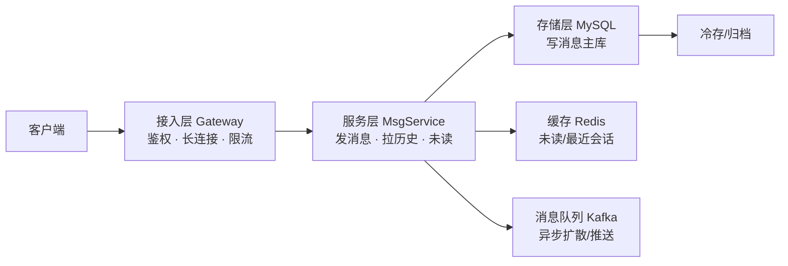

# 02｜系统设计答题框架 · 练习题

先合上知识点，对着 **一节的 20 分钟主线图** 口述一遍：0–3 问约束 → 3–5 容量估算 → 5–8 高层架构 → 8–15 深挖模块 → 15–18 瓶颈扩展 → 18–20 收尾，再来做题。

| 标记 | 含义 |
|------|------|
| **核心** | 不懂整章就没建立起来 |
| **必会** | 值班和面试都要能讲 |
| **常用** | 线上会反复碰到 |
| **常考** | 白板和追问的高频口径 |

## 本题目录

- [Q1 系统设计第一步做什么](#q1)
- [Q2 设计一个 IM 系统，你打算先问什么约束](#q2)
- [Q3 估算一个 IM 系统的 QPS、存储和带宽](#q3)
- [Q4 DAU 1000 万，峰值写 QPS 怎么估算](#q4)
- [Q5 高层架构图怎么画](#q5)
- [Q6 深挖一个模块时怎么讲 trade-off](#q6)
- [Q7 消息存储怎么分库分表](#q7)
- [Q8 未读计数为什么用缓存，缓存挂了怎么办](#q8)
- [Q9 SRE 视角下系统设计还要补什么](#q9)
- [Q10 这个系统瓶颈在哪，怎么扩展](#q10)
- [Q11 被打断或时间不够怎么办](#q11)
- [Q12 最后怎么收尾](#q12)
- [Q13 估算被质疑怎么救](#q13)
- [Q14 设计 IM 系统 20 分钟完整节奏](#q14)
- [合上书](#合上书)

---

## Q1

**★★★★★｜系统设计题，你拿到题后第一步做什么？**

**覆盖**：核心 · 必会 · 常考 ｜ **对应**：知识点 [二、0–3 分钟：先问约束再动手](知识点.md)

### 场景

面试官说「设计一个 IM 系统」。候选人提笔就在白板上画网关、画 Kafka、画 Redis，画了 5 分钟后面试官打断问「你要支持多少人？」，候选人愣住。

### 完整解答

> 🎯 **一句话**：先问约束，把开放题问成封闭题；不问约束直接画，中途会被推翻。

「设计一个 IM 系统」有 100 种答案：可以是千万 DAU 的微信，也可以是内部客服工具。面试官故意把题说大，看你能不能拆维度。第一步要确认六类约束：

```text
1. 功能范围：私聊/群聊/已读/撤回/文件传输，哪些必须做？
2. 用户量级：DAU 多少？峰值同时在线多少？
3. QPS 与读写比：峰值写消息 QPS？读历史消息是写的几倍？
4. 存储量与增长：消息保留多久？含图片/语音吗？
5. 延迟与可用性：发送 P99 要求？能接受几秒不可用？
6. 特殊约束：合规、出海、弱网、客户端电量？
```

开口话术：

> 「我先花 2–3 分钟确认几个约束：功能范围、用户量级、QPS 与读写比、存储保留期、延迟和可用性目标、还有特殊约束。您看我们先按哪些假设往下走？」

> ⚠️ **别混**：功能范围不是把「登录、注册、加好友」列一遍；范围是**边界**——哪些做、哪些不做。

> 📝 **面试**：开场说「我先确认约束再画图」本身就是加分项，说明你有工程判断力，不是背模板。

### 再追问

**面试官说「你先按自己假设做」怎么办？**——主动给一组默认值并继续推进，不要僵住。例如：「那我先按 DAU 1000 万、峰值在线 200 万、峰值写 QPS 25 k、读:写 = 10:1 往下走，数量级对的话架构方向不变，只是机器数会调。」**不要**反复反问等面试官给数字。

---

## Q2

**★★★★★｜如果让你设计一个 IM 系统，你会问面试官哪些约束？**

**覆盖**：核心 · 必会 · 常考 ｜ **对应**：知识点 [二、0–3 分钟：先问约束再动手](知识点.md)

### 场景

面试里常被追问「你刚才问的这几个够了吗」。有人只会重复 DAU 和 QPS，漏掉存储、可用性、特殊约束，导致后面设计站不住。

### 完整解答

> 🎯 **一句话**：六类约束必须全覆盖——功能范围、用户量级、QPS 与读写比、存储与增长、延迟与可用性、特殊约束。

用一个清单回答，边问边解释「为什么问这个」：

| 约束类 | 你问什么 | 它决定什么 |
|--------|----------|-----------|
| 功能范围 | 私聊/群聊/已读/撤回/文件？ | 存储、一致性、协议选型 |
| 用户量级 | DAU？峰值在线？ | 容量估算入口 |
| QPS 与读写比 | 峰值写 QPS？读是写的几倍？ | 写扩、读扩、缓存策略 |
| 存储量与增长 | 保留多久？多媒体占比？ | 分库分表、归档、冷存 |
| 延迟与可用性 | P99 延迟？可接受不可用时间？ | 多活、一致性、降级 |
| 特殊约束 | 合规/出海/弱网/电量？ | 数据驻留、协议、边缘部署 |

> 📝 **面试**：说完清单后补一句「我先按 DAU 1000 万、峰值在线 200 万、读:写 10:1 的假设往下走，如果量级不同，推导链不变」。

### 再追问

**如果题目不是 IM，是排行榜/邮件/发布系统呢？**——六类约束通用，只是把「消息」换成对应实体。例如排行榜要问「实时性要求？全服 Top N 还是个人排名？更新频率？」**不要**生搬 IM 的 DAU 公式，换题要先换变量。

---

## Q3

**★★★★★｜估算一下这个 IM 系统需要多少 QPS、存储和带宽。**

**覆盖**：核心 · 必会 · 常考 ｜ **对应**：知识点 [三、3–5 分钟：容量估算](知识点.md)

### 场景

面试官说「设计一个 IM 系统」，你要在 2 分钟内给出数量级，证明架构不是拍脑袋。

### 完整解答

> 🎯 **一句话**：容量估算的产出不是精确数，而是证明设计在数量级上站得住脚。

先背数字墙，再按 DAU 推导：

```text
1 天 ≈ 86400 秒 ≈ 10⁵ 秒
1M 请求/天 ≈ 12 QPS
峰值 ≈ 均值 × 3~10
存储 = 单条 × 条数 × 保留期 × 副本
带宽 = QPS × 包大小 × 8
```

按 DAU 1000 万、人均 50 条/天、读:写 10:1：

| 步骤 | 算式 | 结果 |
|------|------|------|
| 日发消息 | 1000 万 × 50 | 5 亿条/天 |
| 均值写 QPS | 5 亿 / 10⁵ 秒 | ≈ 5 k QPS |
| 峰值写 QPS | × 5（早高峰） | ≈ 25 k QPS |
| 读 QPS | 25 k × 10 | ≈ 250 k QPS |
| 单条大小 | 文本 200 B + 头 100 B | ≈ 300 B |
| 日存储增量 | 5 亿 × 300 B | ≈ 150 GB/天 |
| 90 天热存 × 3 副本 | 150 GB × 90 × 3 | ≈ 40 TB |
| 下行带宽 | 250 k × 300 B × 8 | ≈ 600 Mbps |

> 📝 **面试**：说完数字后加一句「这些数可以按真实业务调，但数量级上写服务是瓶颈，读服务可以靠缓存扛」——把估算和设计方向挂上钩。

### 再追问

**面试官说「我觉得 25 k 写 QPS 太高了」怎么办？**——不要争数字，说「如果峰值系数按 3 算就是 15 k，按 10 算就是 50 k，架构扩展方向一样，只是分片数和机器数不同」。**不要**说「 industry 都这样」——你的任务是展示推导链，不是捍卫一个数字。

---

## Q4

**★★★★☆｜DAU 1000 万，峰值写 QPS 你按多少算？峰值系数凭什么？**

**覆盖**：核心 · 必会 ｜ **对应**：知识点 [三、3–5 分钟：容量估算](知识点.md)

### 场景

面试官追问「你为什么乘 5 不乘 10」。峰值系数必须有场景理由，否则会被认为瞎拍。

### 完整解答

> 🎯 **一句话**：峰值系数看业务场景——日常 IM 用 3~5，活动/开服用 5~10，平均业务按 3 就够了。

按 DAU 1000 万、人均 50 条/天：

```text
均值写 QPS = 1000 万 × 50 / 86400 ≈ 5.8 k
峰值系数取 5 → 峰值写 QPS ≈ 29 k
```

系数理由：

- **3 倍**：用户分布均匀，无明显高峰。
- **5 倍**：有早高峰、午休、下班三个高峰叠加。
- **10 倍**：大型活动、节日红包、开服瞬间。

> ⚠️ **别混**：峰值系数不是越大越好。拍 10 倍要讲理由（整点活动），拍 3 倍也要讲理由。拍 100 倍没有场景支撑，会让面试官怀疑你在凑数。

### 再追问

**读写比 10:1 也是拍脑袋吗？**——不是。IM 场景用户发送一条消息，接收方平均有多个会话在翻历史；读历史、拉未读、刷新会话列表都会产生读。如果题目是「游戏排行榜」，读:写可能更高（玩家频繁刷新，管理员定时写入）。**不要**所有题都套 10:1，要先看业务。

---

## Q5

**★★★★★｜别急着讲模块，先给我画一张高层架构图。**

**覆盖**：核心 · 必会 · 常考 ｜ **对应**：知识点 [四、5–8 分钟：高层架构图（主干先行）](知识点.md)

### 场景

面试官想看你能不能先抓主线。有人一上来画 15 个框，没有数据流，面试官直接打断。

### 完整解答

> 🎯 **一句话**：高层图先画「客户端 → 接入层 → 服务层 → 存储层」主干，再补缓存、队列、监控。



**读图**：客户端经网关到服务层；写消息落主库，未读计数走缓存，需要扩散的场景进队列。先看清主线，再谈分库分表和限流。

> 📝 **面试**：画框时嘴里要说用途。「这个框是接入层，解决鉴权、长连接保活、限流」——名字看得见，用途靠你讲。

### 再追问

**组件超过 10 个怎么办？**——先画 6–8 个框的主线图，Prometheus、ES、ClickHouse 等细节放到深挖阶段。高层图不是蓝图，是地图。**不要**把高可用副本、监控、日志一股脑全画进去，会淹没主线。

---

## Q6

**★★★★★｜你选一个模块深挖一下，讲讲你为什么这么设计。**

**覆盖**：核心 · 必会 · 常考 ｜ **对应**：知识点 [五、8–15 分钟：深挖 2–3 个模块](知识点.md)

### 场景

这是最常见的追问。只说优点不讲代价，会被认为背模板。

### 完整解答

> 🎯 **一句话**：深挖模块必须用 trade-off 句型：A 优点 X 代价 Y，B 优点 Z 代价 W，本题约束下我选 A，因为…

以「消息存储选 MySQL 还是 Cassandra」为例：

> 「MySQL 优点是事务成熟、团队熟悉、生态好；代价是单机写上限明显，分库分表后跨分片查询复杂。Cassandra 优点是写吞吐高、天然可扩展；代价是最终一致性，开发心智成本高。在本题『需要已读回执、历史消息顺序严格』的约束下，我选 MySQL + 分库分表，因为一致性要求高于写吞吐。」

然后补一句：

> 「如果题目改成『海量日志写入、允许秒级延迟』，我会换成 Cassandra 或 HBase。」

> 📝 **面试**：每次讲完方案主动补「如果约束变 X 我就换 Y」，面试官会顺着追问，节奏在你手里。

### 再追问

**面试官说「你为什么不选 MongoDB？」**——用同样句型：「MongoDB 文档模型灵活、查询方便；代价是大规模分片下一致性模型复杂、运维心智成本高。在本题『强一致、高并发写入』约束下，我倾向 MySQL + 分库分表。」**不要**说「我们团队没用过」——技术选型要回到约束，而不是个人经历。

---

## Q7

**★★★★☆｜消息存储怎么分库分表？按什么分片键？**

**覆盖**：必会 · 常考 ｜ **对应**：知识点 [五、8–15 分钟：深挖 2–3 个模块](知识点.md)

### 场景

面试官追问「按 user_id 分还是按 conversation_id 分」。选错分片键，后续查询路径和热点都会崩。

### 完整解答

> 🎯 **一句话**：分库分表先定分片键；私聊按 user_id、群聊按 conversation_id、日志按时间，热群要单独通道。

| 方案 | 分片键 | 优点 | 代价 | 适合 |
|------|--------|------|------|------|
| 按发送方 user_id | user_id | 写均匀，查自己历史快 | 群聊消息要写多个分片 | 私聊为主 |
| 按会话 conversation_id | conv_id | 单群消息紧凑，翻页快 | 热群会打穿单个分片 | 群聊为主 |
| 按时间 / 消息 ID | msg_id | 顺序好，归档方便 | 查用户历史要扫全库 | 日志/归档 |

**热群问题**：10 万人大群每秒发 1000 条，按 conv_id 分表会打穿一个分片。解法：

1. 大群消息走独立写入队列，按时间分片。
2. 小群写扩散，大群读扩散。
3. 用 Kafka 先削峰再异步落库。

> ⚠️ **别混**：写扩散读快、写重；读扩散写快、读重。IM 小群写扩散体验好，大群必须读扩散。

### 再追问

**分片键定好了，扩容怎么办？**——常用做法是「预设足够分片数，先部署少量实例，后期加实例迁移分片」；或者「按时间维度再分，老数据不动，新数据进新分片」。**不要**说「直接在线 rebalance」——大规模 rebalance 风险高，要有灰度和回滚方案。

---

## Q8

**★★★★☆｜未读计数为什么放 Redis？Redis 挂了怎么办？**

**覆盖**：必会 · 常用 · 常考 ｜ **对应**：知识点 [五、8–15 分钟：深挖 2–3 个模块](知识点.md)

### 场景

IM 读:写 10:1，未读计数是典型读热点。只说「放 Redis 因为快」不够，要讲一致性、降级。

### 完整解答

> 🎯 **一句话**：未读计数读多写少、可容忍秒级不一致，适合 Redis；但必须有回源和降级，不能直接打挂 DB。

| 方案 | 优点 | 代价 | 一致性 |
|------|------|------|--------|
| Redis 计数器 | 读极快、可水平扩展 | 丢数风险、需回源校验 | 最终一致 |
| MySQL 计数 | 强一致 | 读竞争大、易成瓶颈 | 强一致 |
| Redis + 异步刷库 | 读快、持久化 | 实现复杂、需兜底 | 最终一致 |

推荐：**Redis 做未读计数 + 异步刷 MySQL 对账**。Redis 挂了可以回源 MySQL，只是读慢一点；同时要有熔断，防止缓存击穿把 DB 打挂。

> 📝 **面试**：讲完缓存一定要讲「一致性怎么保证」和「挂了怎么兜底」。只讲快不讲兜底，会被认为没在生产环境踩过坑。

### 再追问

**怎么防止缓存雪崩？**——过期时间加随机偏移、热点 key 设置永不过期 + 定时刷新、集群多副本、限流熔断。**不要**说「加集群就够了」——集群解决的是容量，不解决热点和雪崩。

---

## Q9

**★★★★☆｜SRE 视角看，这个设计还缺什么？**

**覆盖**：必会 · 常考 ｜ **对应**：知识点 [五、8–15 分钟：深挖 2–3 个模块](知识点.md)

### 场景

普通后端答到「能跑」就停了。SRE/游戏运维面试必须补可观测性、容量、降级、灰度。

### 完整解答

> 🎯 **一句话**：SRE 视角要在功能设计之上补四层：可观测性、容量水位、降级预案、灰度。

1. **可观测性**：
   - Metrics：QPS、延迟 P99/P999、错误率、连接数。
   - Logs：链路 ID，方便定位单条消息卡在哪。
   - Traces：跨网关、服务、DB、缓存的请求链。

2. **容量水位**：
   - CPU/内存/连接数/磁盘容量告警阈值。
   - 扩缩容触发线：比如 CPU > 60% 扩容，< 30% 缩容。

3. **降级预案**：
   - 缓存挂了 → 回源 DB + 限流。
   - 队列满了 → 丢弃非关键消息，只保证在线用户。
   - 推送失败 → 降级为客户端拉取。

4. **灰度**：
   - 按用户尾号 1% → 5% → 20% → 全量。
   - 按区服/版本灰度，出问题一键切流。

> 📝 **面试**：讲完模块补一句「上线后我会重点看 XX 指标，水位到 YY 就扩，ZZ 情况直接降级为兜底方案」——这几句话能把答案从「后端设计」拉到「SRE 设计」。

### 再追问

**可观测性和监控是不是一回事？**——不是。监控是「出事了告诉我」，可观测性是「告诉我为什么出事」。Metrics 看趋势，Logs 看细节，Traces 看链路，三者缺一不可。**不要**只列 Prometheus + Grafana 就认为做完了可观测性。

---

## Q10

**★★★★☆｜这个系统最大瓶颈在哪？如果 DAU 翻 10 倍，你怎么扩展？**

**覆盖**：必会 · 常考 ｜ **对应**：知识点 [六、15–18 分钟：权衡、瓶颈与扩展](知识点.md)

### 场景

面试官想看你有没有「哪个资源会先爆」的直觉，以及扩展是不是只会说「加机器」。

### 完整解答

> 🎯 **一句话**：先回到容量估算，找出最先会爆的资源；无状态服务加机器，有状态服务先做数据分片或状态外迁。

按前面 IM 估算：峰值写 25 k QPS，单 MySQL 实例写上限约 2 k QPS，所以**写主库**大概率先爆。扩展方向：

| 资源 | 扩展手段 | 注意点 |
|------|----------|--------|
| 读 QPS | 加缓存、加从库 | 缓存一致性、主从延迟 |
| 写 QPS | 分库分表、异步写队列 | 分片键、顺序保证 |
| 连接数 | 网关水平扩展、无状态化 | 状态外迁到 Redis |
| 带宽 | 边缘节点、CDN、压缩 | 弱网场景 |
| 存储 | 冷热分离、归档、压缩 | 保留期、合规 |

> 💡 **打个比方**：扩展不是「加机器」三个字。加机器解决的是无状态服务；有状态服务要先做**数据分片**或**状态外迁**，否则加机器只是搬家。

### 再追问

**DAU 翻 10 倍，分片数要翻 10 倍吗？**——不一定。如果已经按 10 倍余量预分片，只需加实例、迁移分片；如果没预分片，可能要重新分片，这是高风险变更，需要灰度。**不要**说「直接水平扩展」——有状态服务的扩展远复杂于无状态服务。

---

## Q11

**★★★★☆｜时间只剩 3 分钟了，你还没讲完，怎么办？**

**覆盖**：必会 · 常考 ｜ **对应**：知识点 [八、作战：常见翻车与抢救](知识点.md)

### 场景

实战面试常被打断或时间不够。会不会抢救，直接决定分数。

### 完整解答

> 🎯 **一句话**：时间不够时立刻跳到收尾三句话，主动总结决策和不足，不要在细节上硬撑。

收尾三句话：

1. **最终设计**：「最终采用『长连接网关 + 消息队列异步扩散 + MySQL 分库分表 + Redis 缓存未读』。」
2. **关键取舍**：「为了强一致牺牲了部分写吞吐，在 IM 场景下可接受。」
3. **下一步**：「如果时间更多，我会细化热群拆分和多活一致性。」

如果是被打断：

> 「您问的这个点我正好要展开：……」（把追问变成加分机会）。

如果是估算被质疑：

> 「这个量级我按峰值 ×5 估算，如果实际系数不同，机器数会线性调整，架构方向不变。」

### 再追问

**面试官一直打断你，是不是说明你答偏了？**——不一定。面试官打断说明他对某个点感兴趣，**跟着他走**，不要强行把背完的模板讲完。如果确实答偏了，说「我先回到主线：本题的约束是……」。**不要**说「您能让我说完吗」——这是节奏自杀。

---

## Q12

**★★★★★｜最后 2 分钟，用三句话总结你的设计。**

**覆盖**：核心 · 必会 · 常考 ｜ **对应**：知识点 [七、18–20 分钟：收尾与主动暴露不足](知识点.md)

### 场景

收尾不是复述全文，而是让面试官记住你的核心决策和取舍。

### 完整解答

> 🎯 **一句话**：收尾三句话——最终设计是什么、关键取舍是什么、下一步细化什么。

示例：

> 「最终采用『长连接网关 + Kafka 异步扩散 + MySQL 分库分表 + Redis 缓存未读』的架构。为了已读回执和历史顺序的强一致，牺牲了部分写吞吐，在本题约束下这是值得的。如果时间更多，我会把热群拆分、多活一致性以及降级剧本再细化。」

主动暴露不足：

> 「实时 push 这块我没有大规模实操经验，所以方案偏拉模式；如果团队有成熟推送通道，我会把 push 改成服务间调用。」

> 📝 **面试**：主动说不足不会扣分，反而展示边界意识和可培养性。最怕的是答完像「这个系统永远不会坏」。

### 再追问

**能不能只说一句话收尾？**——可以，但要包含三个要素：「最终设计 + 关键取舍 + 一个风险」。例如：「最终用 MySQL 分库分表做主存储、Redis 扛读，取舍是强一致换写吞吐，最大风险是热群打穿分片，需要单独通道。」**不要**只说「我设计完了」——那是浪费最后加分机会。

---

## Q13

**★★★★☆｜容量估算被面试官质疑「拍脑袋」，怎么救？**

**覆盖**：必会 · 常考 ｜ **对应**：知识点 [三、估算：从 DAU 到 QPS](知识点.md)

### 场景

你说「500 万 DAU，峰值 QPS 5 万」，面试官问「系数哪来的？」

### 完整解答

> 🎯 **一句话**：把假设摊开——DAU × 活跃率 × 峰值系数 ÷ 86400，并说明「系数变 2 倍，机器数线性变 2 倍，架构方向不变」。

```text
500万 DAU × 20% 同时在线 ≈ 100万 CCU（游戏场景）
登录峰 = 开服/活动瞬间 ≈ 日常 10×～30×
QPS = 请求数/用户/天 × DAU峰值 / 86400
```

> 📝 **面试**：「这是量级估算，不是合同数字；关键约束是读写比和 P99，资源按瓶颈层扩。」

### 再追问

**没有历史数据怎么办？**——用同类游戏公开数据或压测标定；标注 uncertainty range（0.5×–2×）。**不要**装精确。

---

## Q14

**★★★★★｜综合：设计 IM/聊天系统，20 分钟怎么分配时间？**

**覆盖**：核心 · 必会 · 常考 ｜ **对应**：知识点 [一、一张图：系统设计题的一生](知识点.md) · [合上书](知识点.md)

### 场景

白板 IM 题，常见翻车：上来画 WebSocket，不问群聊规模。

### 完整解答

> 🎯 **一句话**：0–3min 约束 → 3–5min 容量 → 5–8min 骨架 → 8–15min 深挖（存储/未读/热群）→ 15–20min 瓶颈+收尾。

关键深挖点：

```text
① 单聊 vs 群聊 vs 超大群——存储模型不同
② 未读数：读扩散 vs 写扩散
③ 热群：单独通道或分片
④ 离线消息：收件箱模型 + 推拉结合
⑤ SRE 加分：消息投递 SLI、降级（只拉不推）
```

> 📝 **面试**：「我先问最大群人数和消息保留期——这决定分片键和存储成本。」

### 再追问

**WebSocket 和 HTTP 长轮询怎么选？**——强实时用 WebSocket；弱实时/移动端省电可混合。**不要**不问约束就定协议。

---

## 合上书

对齐知识点「合上书」，逐条口述，卡住就回对应节：

- [ ] **口述 20 分钟主线**：0–3 问约束 → 3–5 容量估算 → 5–8 高层架构 → 8–15 深挖模块 → 15–18 瓶颈扩展 → 18–20 收尾。（Q1 · Q11）
- [ ] **默写 6 类约束清单**：功能范围 / 用户量级 / QPS 与读写比 / 存储量与增长 / 延迟与可用性 / 特殊约束。（Q2）
- [ ] **口述容量估算推导链**：DAU → 峰值 QPS → 读/写 QPS → 存储 → 带宽，每个公式举一个数字例子。（Q3 · Q4）
- [ ] **口述高层图原则**：主干先行、组件不超过 10 个、先画数据流再补高可用。（Q5）
- [ ] **口述 trade-off 句型**：A 优点 X 代价 Y，B 优点 Z 代价 W，本题约束下选 A，约束变 XX 换 B。（Q6）
- [ ] **口述 SRE 四层加分项**：可观测性、容量水位、降级预案、灰度。（Q9）
- [ ] **口述分库分表关键**：先选分片键；私聊/群聊/日志分别适合 user_id / conv_id / time；热群要单独通道或读扩散。（Q7）
- [ ] **口述缓存使用原则**：读多写少、最终一致、必须有降级回源；缓存挂了不能直接把 DB 打死。（Q8）
- [ ] **口述瓶颈与扩展**：从估算里找先爆的资源；读扩/写扩/连接数/带宽/存储各自用什么手段。（Q10）
- [ ] **口述四大翻车信号与抢救**：上来就画、闷头画、估算瞎拍、只堆名词——各怎么救。（Q11）
- [ ] **口述收尾三句话**：最终设计是什么、关键取舍是什么、下一步细化什么。（Q12）
- [ ] **口述估算被质疑时救场**：假设摊开、线性缩放、架构方向不变。（Q13）
- [ ] **口述 IM 题 20 分钟节奏 + 热群/未读深挖**。（Q14）
- [ ] **口述联动入口**：具体游戏五题 → [03](../03-游戏SRE系统设计实战/)；STAR 话术 → [01](../01-STAR项目话术/)；分布式一致性 → [02-06](../../02-中间件与数据库/06-分布式理论与一致性/)；分库分表 → [02-07](../../02-中间件与数据库/07-分库分表与中间件/)；容量模型细节 → [07-04](../../07-游戏运维专题/04-全链路压测与容量模型/)；高可用 → [01-33](../../01-基础底座/33-高可用与容灾/)。
