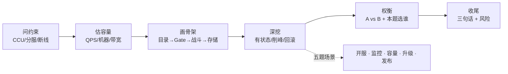
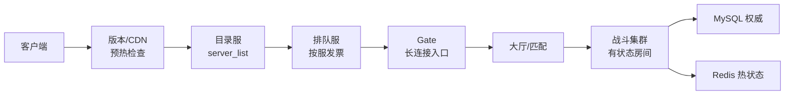
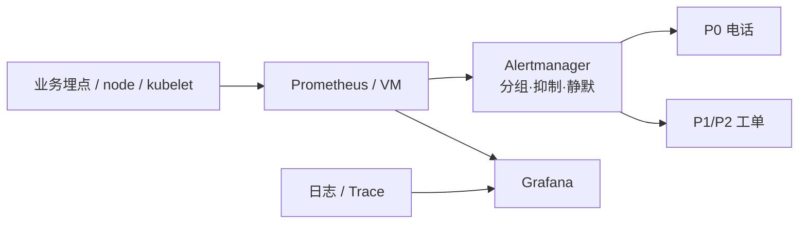
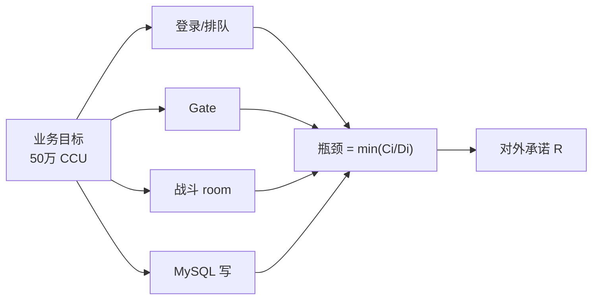
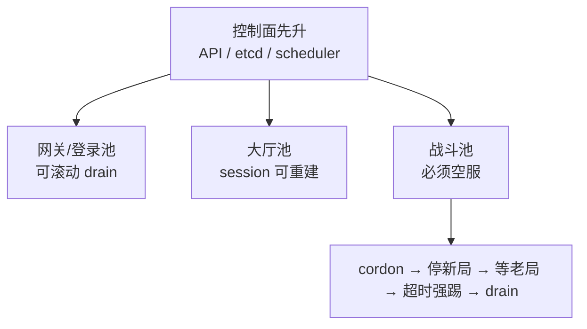
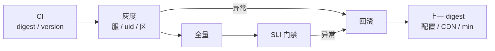
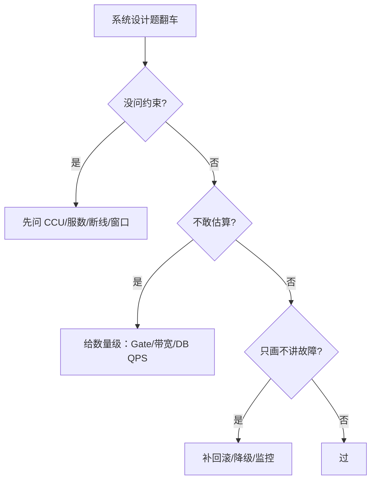

# 游戏 SRE 系统设计实战

> 面试官说「设计开服系统」——有人立刻画 Gate→Battle→DB，忘了问 CCU 和排队；说「设计监控」——有人堆满 Prometheus 面板，却说不出 CCU 腰斩该怎么叫醒值班。
> **本章回答**：五道游戏 SRE 系统设计高频题，按「问约束 → 估容量 → 画骨架 → 深挖故障 → 谈权衡 → 收尾」给可背口径。
> **不讲**：通用答题节奏 → [02](../02-系统设计答题框架/)；TCP/K8s/MySQL 细节 → 各技术章；开服合服/压测/热更专章 → [07-06](../../07-游戏运维专题/06-开服合服/)、[07-04](../../07-游戏运维专题/04-全链路压测与容量模型/)、[07-05](../../07-游戏运维专题/05-热更新与版本发布/)。

**标记**：🎯重点 · 🔥难点 · ⭐常考 · 🔧实操
---

## 一、一张图：一道系统设计题的一生

> 🎯 **一句话**：每道题共用一条时间线——约束先于图，数字先于权衡；五题只是深挖场景不同。



- 📖 **读图**
  - 🛤️ 主线是面试时间线，不是五套独立背诵；跳过「问约束/估容量」直接画图是最大翻车
  - 🎮 深挖必含：战斗服有状态、开服削峰、回滚 RTO、SLI 定标——缺任一会被打回 Web 思维

本节对应练习题 Q1、Q14。主线有了——先钉通用四步。

---

## 二、开场：通用四步肌肉记忆

> 🎯 **一句话**：系统设计轮不是先画图，而是先问清约束、再算数、再落架构。

- 🗺️ **四步顺序**（[02](../02-系统设计答题框架/) 原样用）
  - **澄清约束**：峰值 CCU、滚服还是大服、断线容忍、预算、发布窗口
  - **估算容量**：从 CCU 推登录 QPS、Gate/战斗/DB/带宽，敢给数量级
  - **画骨架**：客户端 → 目录 → 排队 → Gate → 大厅/战斗 → 存储，标状态边界
  - **深挖 + 权衡**：先讲最可能翻车的点，再说 A 为什么优于 B

> 💡 **打个比方**：像装修——先量房（约束）、再算预算（容量）、再画平面图（架构），最后才谈「地砖要不要上墙」。没量房就画图，面积一定错。

> 📝 **面试**：开场 30 秒——「我先确认：峰值 CCU？新服滚服还是单一大服？在线能否接受 30 秒断线？预算和窗口？问完再画图。」⭐

本节对应练习题 Q1。通用动作外，开服第一题。

---

## 三、开服：登录入口受控放量

> 🎯 **一句话**：开服 = 版本/CDN → 目录打散 → 排队令牌桶 → Gate 预扩 → 战斗空 room 预开——让玩家进得来、分得匀，而不是同时砸穿一台 Gate。

### 🎤 面试官怎么问 ⭐

「设计新游开服技术保障。」「每天开 N 个新服，失败能回滚吗？」「瞬间 10 万人登录怎么不炸？」

### 🧭 先钉约束 🎯

- 预期 **CCU** 与 DAU → 定 Gate/排队/战斗规模
- 滚服还是单一大服 → 故障域与扩容方式完全不同
- 排队容忍、客户端强更/热更、是否与活动叠窗

### 📐 容量数量级 🔧

```text
目标：单服 5 万 CCU，首服 10 万同时在线；开服登录峰 ≈ 日常 10×～30×

Gate：单进程约 2～6 万长连接 → 10 万 CCU 至少 4～8 台
战斗：每进程 50～200 room → 必须预开空 room，不能靠 HPA 现场救
DB：登录 QPS ≈ CCU × 0.3～1；创角写尖刺单独限流
带宽：下行 5～20 kbps/人 → 10 万 CCU ≈ 1～2 Gbps 出向，预留 30%
```

> ⚠️ **别混**：**下载峰 ≠ 在线峰**。CDN **预热**和 Gate 预扩是两本账 → [07-08](../../07-游戏运维专题/08-CDN与资源更新/)。

### 🏗️ 骨架与三道闸 🎯⭐🔥



- 📖 **读图**
  - 🚪 左到右三道闸：CDN/版本 → 目录推荐打散 → 排队按服发票 → Gate → 空 room
  - 任一闸漏掉，后一闸就被打穿

- 🔑 **关键机制**
  - **选服列表**：新服「推荐」、老服「爆满」——爆满只拦新创角，不拦已有角色
  - **排队**：**令牌桶**定速放行，保护 Gate 与 DB 不被登录洪峰冲垮
  - **预热**：Gate 预扩、战斗空 room 预开、目录缓存预热、静态表预导入
  - **回滚**：未写目录可拆环境；已写目录先摘目录或标维护

> 🔍 **现场**：盯 `drain_rate`、Gate 连接、empty_rooms 三个数一起看。

```bash
redis-cli HGET queue:config:S101 drain_rate_per_sec
# ← 每秒放行；过小玩家骂、过大 DB 炸
curl -sS 'http://prom:9090/api/v1/query?query=sum(gate_connections)' \
  | jq -r '.data.result[0].value[1]'   # ← Gate 长连接水位
curl -sS 'http://prom:9090/api/v1/query?query=sum(battle_empty_rooms{server_id="S101"})' \
  | jq -r '.data.result[0].value[1]'   # ← 空 room=0 时匹配会堵
```

#### ❓ 为什么不能只加 Gate、不排队？

- ❌ **只加 Gate**：连接层扛住了，登录/创角仍瞬时打满 DB 连接池 → 登录成功率雪崩
- ✅ **令牌桶**：把尖峰削成平台，Gate 与 DB 按可承载速率吃人
- 🎮 **空 room 必须预开**：HPA 扩出的是空 Pod，没有预开 room 救不了已开服

> 💡 **打个比方**：演唱会不能同时挤进门——检票口按票根分批放人，场内座位（战斗 room）才坐得稳。

- 🧯 **失败预案**
  - 未写目录 → 标 dirty，拆环境重来
  - 已写目录冒烟失败 → 先摘目录/标维护，再修静态表
  - 延迟开服 → 目录回退 + 公告同步，不要硬开

- ⚖️ **权衡一句话**：不排队体验最好但成本买到瞬时尖峰；严格排队护库但要公告；滚服故障域小、大服社交好但爆炸半径大

> 📝 **面试**：「先问 CCU、滚服/大服、能否排队。骨架 CDN→目录→排队→Gate→战斗；令牌桶削峰；Gate/战斗预热。失败未开放拆环境，已开放先摘目录。」⭐（Q1、Q2）

本节对应练习题 Q1、Q2。开服外，监控告警。

---

## 四、监控：告症状，不告机器

> 🎯 **一句话**：游戏监控围绕「能不能登录、能不能玩、钱到没到账」建 SLI，再用分组/抑制/静默压住开服风暴——不是把 CPU 面板堆满。

### 🎤 面试官怎么问 ⭐

「设计游戏服监控告警。」「开服电话被打爆怎么办？」「什么叫该半夜叫醒？」

### 🧭 先钉约束

- 对象：全局层（登录/支付）还是分服/分玩法
- CCU 量级 → 采样率与高基数成本
- 值班是否 7×24、P0/P1 通道是否分离

### 📐 基数不能玩家级 🔧

```text
10 万 CCU × 每玩家 20 条业务指标 × 10s → 玩家级 series 不可行
做法：按 server_id / 玩法 / 渠道聚合 + 采样 trace + 个案日志
原始 30 天，下采样 90 天；日志 7 天热 + 冷存
```

### 🏗️ 三件套骨架 🎯⭐



- 📖 **读图**
  - 📊 TSDB 供告警与看板；Alertmanager 降噪后分级通知；日志/Trace 只供下钻
  - 没有分组抑制，一条网卡抖动就能打爆开服电话

- 🎮 **游戏特有信号**（比 CPU 更先看）
  - **CCU**：同时在线；异常腰斩是全服静默哨兵
  - **帧频 / tick**：战斗主循环 P99，卡顿不一定有 5xx
  - **empty_rooms**：战斗层容量；HPA 常按它扩
  - **登录漏斗**：尝试 → Gate → 大厅 → 进战斗，分段转化率

#### ❓ 为什么半夜不该叫醒所有 P2？

- ❌ **电话越多越好** → 告警疲劳，真 P0 被淹没
- ✅ **只叫醒可行动的 P0**：5min 窗口登录成功率破 SLO，或 CCU 异常腰斩
- 🧯 **开服风暴三板斧**：按 server_id 分组；登录破 SLO 时抑制下游派生告警；维护/压测窗口提前静默

> ⚠️ **别混**：**告警多 ≠ 监控全**。告警必须可行动——收到后知道先查哪一层 → [09-03](../../09-可观测性与SRE方法论/03-告警设计与降噪/)。

> 🔍 **现场**：tick 进主循环统计，别每帧打日志。

```python
# 滑动窗口聚合后上报，不要每帧 print
if frame_id % 60 == 0:
    prometheus.tick_latency.observe(window_p99)
```

> 📝 **面试**：「围绕登录/进战斗/支付/CCU 完整性定 SLI；Prometheus + Alertmanager 分组抑制；半夜叫醒条件是 5min 登录破 SLO 或 CCU 腰斩。」⭐（Q3、Q4）

本节对应练习题 Q3、Q4。监控外，容量模型。

---

## 五、容量：分层账本 × 三峰 × α

> 🎯 **一句话**：容量不是「CCU ÷ 单服承载」一道式，而是目标 CCU → 登录 QPS → Gate → 战斗 room → MySQL 写 → 带宽；每层压测校准，再统一乘 α=0.7。

### 🎤 面试官怎么问 ⭐

「50 万 CCU 要多少机器？」「瓶颈在哪层？」「活动峰值怎么留余量？」

### 🧭 先钉约束

- CCU 口径（是否含机器人）、三峰是否错峰、玩法类型、预算、能否真协议压测

#### ❓ 为什么不能按一个 CCU 把全链路买满？

- 🔥 **三峰往往错峰**：登录峰打排队/Gate；玩法峰打战斗 CPU/Redis；发奖峰打 MySQL 写
- ❌ **按开服瞬间 CCU 全买满** → 日常利用率极低，仍可能漏掉发奖写尖刺
- ✅ **口诀**：**「三峰分开算，再乘 α=0.7」**

### 📐 50 万 CCU 算例 🎯⭐🔥

```text
1. 登录峰：CCU × 0.5 → ≈4200 QPS（瞬时尖刺再 ×2～×3）
2. Gate：55 万长连接 / 单机 4 万 ≈ 14 台；÷0.7 → ≈20 台
3. 战斗：60% 在战斗 → 3 万 room / 100 room·进程 ≈ 300；÷0.7 → ≈430 进程
4. 带宽：10 kbps × 50 万 = 5 Gbps；+30% → ≈7 Gbps
5. MySQL 写：发奖/结算单独估，可能 5k～20k TPS，不与登录峰共用预算
```



- 📖 **读图**：最窄那层决定对外能承诺多少；一个 CCU 数字不能买所有层

- 🔧 **校准三步**
  1. 单组件压测找饱和点
  2. 全链路真协议机器人走登录→排队→Gate→战斗→结算
  3. 投产目标 = 压测饱和点 × **0.7**，写进 HPA max 与 runbook

> ⚠️ **别混**：**压测最大值 ≠ 投产目标** → [07-04](../../07-游戏运维专题/04-全链路压测与容量模型/)。

```yaml
# capacity_ledger.yaml 片段
layers:
  - name: gate_connections
    C: 800000   # 饱和 ×0.7
    D: 550000   # 当前目标
  - name: mysql_write_tps
    C: 7000
    D: 5000
```

- ⏱️ **扩容 lead time**
  - Gate 无状态 → 分钟级 HPA
  - 战斗扩空 room，救不了已开局 → 要预开窗口
  - MySQL 写最难 → 靠分片/降 batch，不是加机器

> 📝 **面试**：「50 万 CCU 先拆三峰，逐层算 C/D，压测找 min 瓶颈，乘 0.7。MySQL 写和战斗 room 最常漏。」⭐（Q5、Q6）

本节对应练习题 Q5、Q6。容量外，集群升级。

---

## 六、升级：战斗池必须空服

> 🎯 **一句话**：K8s 升级不能把战斗节点和网关一起 drain——战斗有状态，必须 cordon → 停新局 → 等 room 空 → 再 drain。

### 🎤 面试官怎么问 ⭐

「1.28→1.29，战斗不能集体掉线怎么升？」「在线可接受 30 秒断线，方案怎么做？」

### 🧭 先钉约束

- 断线容忍、升级范围（控制面/节点/runtime）、room 能否迁移、叠窗、失败 RTO

### 🏗️ 节点池分组 🎯⭐🔥



- 📖 **读图**
  - 控制面先；无状态可滚；大厅 session 在 Redis 可重建
  - 战斗 room 钉在进程内存 → 必须等空或维护窗强踢

#### ❓ 为什么战斗服不能直接 RollingUpdate？

- ❌ **RollingUpdate = 杀对局**：PDB 挡不住匹配器继续往旧节点塞新局
- ✅ **优雅下线四步**：① cordon ② 匹配器停新局 ③ 等 room 自然结束（看 P99 时长）④ 超时强踢后 drain
- 🔁 Gate 断线后客户端应走**重连快通道**，避免重新排队；跨服池与本服池分开升

> 💡 **打个比方**：像装修手术室——先把新手术排到别的房间，等现有手术做完再换设备。不能掀开做到一半的手术台。

- ⚖️ **策略**：滚动省资源但战斗需摘流；蓝绿回切快但双倍机器；按区分批风险小但总时长长

> 📝 **面试**：「战斗有状态，不能像 Web 滚。节点池分组：网关可滚；战斗先 cordon、停新局、等 room 空再 drain。控制面先于节点，战斗单独窗口。」⭐（Q7、Q8）

本节对应练习题 Q7、Q8。升级外，发布系统。

---

## 七、发布：灰度漏斗与四类回滚

> 🎯 **一句话**：发布 = CI 钉 digest/version → 灰度（服/uid/区）→ 全量 → 回滚；战斗走摘流，配置热更独立，回滚不是一个按钮。

### 🎤 面试官怎么问 ⭐

「设计灰度和一键回滚的发布系统。」「热更和冷更怎么选？」「灰度粒度？回滚时限？」

### 🧭 先钉约束

- 发布频率、无状态 2～5min / 有状态可能小时级 RTO、room 能否热更、强更窗口、灰度对象

### 🏗️ 漏斗骨架 🎯⭐



- 📖 **读图**
  - 漏斗：内网 → 指定服 → uid 1% → 5% → 20% → 全量；每档 SLI 门禁
  - 回滚对象可能是镜像 digest、配置 version、CDN 指针、客户端 min——不是同一按钮

- 📦 **通道分工**
  - 大厅/登录：滚动或蓝绿
  - 配置/活动数值：热更 reload + `loaded_version` 回执，**不配 RollingUpdate**
  - 战斗二进制：摘流四步——停新局、等老局、flush、换 digest
  - 客户端资源：CDN 指针；协议强更走版本门闸

#### ❓ 为什么热更不是滚动更新？

- 🔥 **热更** = 进程内 reload（配置/脚本/资源），不重启；改不了结构体布局与协议语义
- 🔥 **冷更** = 换镜像 / 协议不兼容 → 必须发布流程或强更
- ❌ **战斗 RollingUpdate = 杀对局**；灰度按源 IP 会被加速器/NAT 毁比例 → 按 uid/服/区
- ⚠️ 代码回滚 ≠ 配置回滚：undo 工作负载后还要查 CM/CR 是否仍是新版 → [07-05](../../07-游戏运维专题/05-热更新与版本发布/)

> ⚠️ **别混**：**热更 ≠ 滚动更新**。热更是进程内 reload，滚动是换 Pod。

> 📝 **面试**：「CI 钉制品 → 灰度漏斗 → 全量 → 回滚四层。战斗摘流四步；配置热更独立；灰度按 uid/服/区；回滚分 digest/version/指针/min。」⭐（Q9～Q11）

本节对应练习题 Q9～Q11。发布外——共同翻车。

---

## 八、作战：五题翻车决策树

> 🎯 **一句话**：共同翻车只有三类——不问约束就画、估算不敢给数、只画架构不讲故障。



- 📖 **读图**：考的是「约束→数字→架构→故障」闭环，不是图画得漂不漂亮

### 现象 · 先做 · 别做

| 现象 | 先做 | 别做 |
|------|------|------|
| 追问「多少机器」 | 从 CCU 推导数量级 | 「看压测」回避 |
| 「在线不能断」 | 战斗单独优雅下线 | 直接 RollingUpdate |
| 「失败怎么办」 | 分 digest/version/指针/min | 只说「一键回滚」 |
| 「活动峰值」 | 拆登录/玩法/发奖三峰 | 一个 CCU 买全链路 |
| 「开服不炸」 | 排队+令牌桶+预热+预扩 | 只加 Gate |

### 60 秒剧本 🔧

```text
0–10s   重复题目，确认 CCU、服型、断线、窗口、预算
10–30s  估登录 QPS、Gate/战斗/DB/带宽 + α
30–45s  画 客户端→目录→排队→Gate→大厅/战斗→存储，标状态
45–60s  深挖最可能坏的点 + 回滚/降级 + 一句收尾
```

本节对应练习题 Q12～Q14。

---

## 九、收口：话术与数字墙

### 五题 30 秒版 ⭐

| 题 | 30 秒答 |
|----|---------|
| 开服 | 确认 CCU/滚服；CDN→目录→排队→Gate→战斗；令牌桶；预热；失败先摘目录 |
| 监控 | 登录/进战斗/支付/CCU 四条 SLI；Alertmanager 分组抑制；tick/room 是特有信号 |
| 容量 | 三峰分层算 C/D；压测 min 瓶颈；×0.7；写进 HPA/runbook |
| 升级 | 控制面先；网关可滚；战斗 cordon→停新局→等空→drain |
| 发布 | 钉 digest/version；灰度 uid/服/区；战斗摘流；回滚分四类 |

### 命令速查 🔧

```bash
# 开服三水位
redis-cli HGET queue:config:S101 drain_rate_per_sec
# Gate / empty_rooms 用 PromQL sum(gate_connections) / sum(battle_empty_rooms{...})

# 升级前确认战斗池无局
kubectl cordon <node>
kubectl get pods -l tier=battle -o wide   # ← 确认已迁空再 drain
```

### 易错一句话对照

- 不问约束就画图 → 先问 CCU/服数/断线/预算/窗口
- CCU 直接除单服承载 → 拆三峰、分层算、压测校准
- 开服只加 Gate → 还要排队、预热、空 room、DB 限流
- 监控只采 CPU → 必须采 CCU、tick、room、登录漏斗
- 电话越多越好 → 分组抑制，夜间只叫 P0
- 战斗 RollingUpdate → 摘流等 room 空
- 热更=滚动更新 → 热更是进程内 reload
- 一键回滚包治百病 → 分 digest/配置/指针/min
- 余量越少越好 → α=0.7 扛活动尖刺
- 灰度按源 IP → 按 uid/服/区
- 压测最大值当投产 → 必须乘安全系数

### 数字墙

> Gate：**2～6 万** 长连接/进程 · 战斗：**50～200 room**/进程 · 登录 QPS ≈ CCU × **0.3～1** · α：**0.7** · 发奖 batch：**500～5000**/批 · 灰度：**1%→5%→20%→全量** · 无状态回滚：**2～5 min** · 开服冒烟：**8～15 min**

---

## 合上书

- [ ] **口述通用四步**：澄清约束 → 估算 → 画骨架 → 深挖权衡
- [ ] **默画开服骨架**：CDN → 目录 → 排队 → Gate → 大厅/战斗 → 存储，标三道闸
- [ ] 说出令牌桶、预热预开、失败先摘目录三件事
- [ ] **口述监控三件套**：Prometheus 采什么、Alertmanager 压什么、Grafana 下钻什么
- [ ] 列出 CCU、tick、room、登录漏斗四条特有指标
- [ ] **口述 50 万 CCU 算例**：Gate/战斗/带宽/DB，每层 ×0.7
- [ ] 解释三峰为什么不能一个 CCU 买全链路
- [ ] **口述升级分组**：网关可滚，战斗空服 drain
- [ ] 说出优雅下线四步：cordon → 停新局 → 等空 → drain
- [ ] **口述发布四层**：钉制品 → 灰度 → 全量 → 回滚；区分四类回滚对象
- [ ] 解释热更与冷更边界
- [ ] **口述翻车决策树**：不问约束 → 不敢估 → 不讲故障

下一章：[04 自我介绍与行为面](../04-自我介绍与行为面/)。联动：[02](../02-系统设计答题框架/) · [07-01](../../07-游戏运维专题/01-游戏服务器架构/) · [07-04](../../07-游戏运维专题/04-全链路压测与容量模型/) · [07-05](../../07-游戏运维专题/05-热更新与版本发布/) · [07-06](../../07-游戏运维专题/06-开服合服/) · [09-03](../../09-可观测性与SRE方法论/03-告警设计与降噪/) · [03-16](../../03-Kubernetes/16-灰度与回滚/)。
