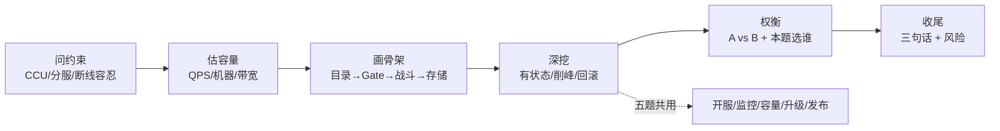
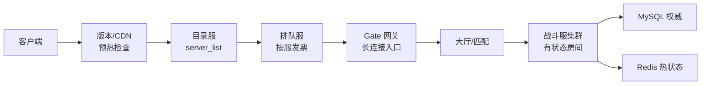
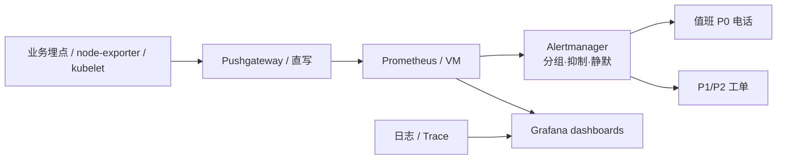
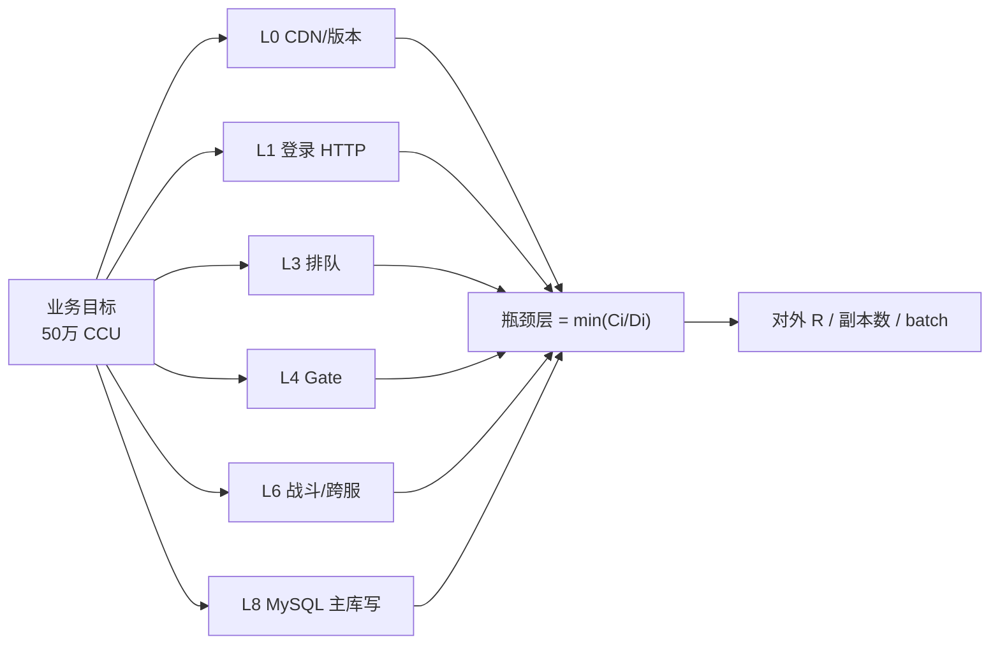
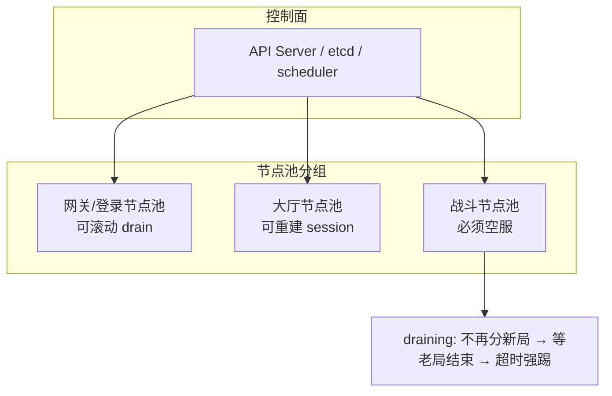
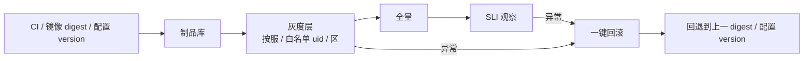
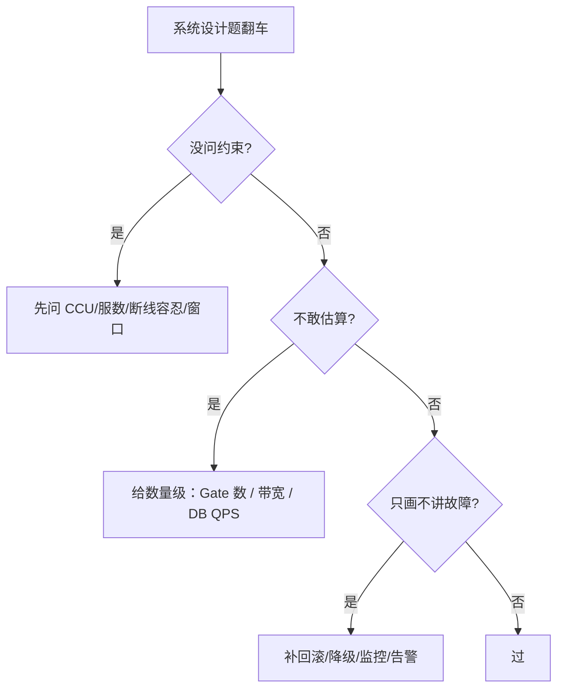

# 游戏 SRE 系统设计实战

> 大家好，欢迎来到这次分享。开讲之前，先带大家回到一个很多同学都经历过的现场：
> 面试官说「设计一个开服系统」——有人立刻画 Gate→Battle→DB，忘了问预期 CCU 和排队策略；说「设计监控告警」——有人堆满 Prometheus 面板，却说不出 CCU 掉了该怎么叫醒值班。

大家想想：开服题第一句该说什么？很多人会答「先画架构」——**错了**。先问 CCU、滚服还是大服、断线容忍——[02](../02-系统设计答题框架/) 的约束节在这里原样用。
> 这一章讲完，你会知道那两个人错在跳过 CCU/叫醒路径，以及五道题各自的 30 秒口径。
> **本章回答**：五道游戏 SRE 系统设计高频题的完整答题示范，每道题按「问约束 → 估容量 → 画骨架 → 深挖点 → 谈权衡 → 一句话收尾」给可背口径。
> **不讲**：系统设计的通用节奏（先问约束再画图）→ [02](../02-系统设计答题框架/)；具体技术点（TCP、K8s、MySQL 调优）→ 各技术章。这些都有专门的章节，本章只在用到时点到为止。

**标记**：🎯重点 · 🔥难点 · ⭐常考 · 🔧实操

**怎么听这场分享**：咱们先看第一节五道题怎么共用「问约束 → 估容量 → 画骨架 → 深挖权衡」；后面按开服、监控、容量、升级、发布五题各走一遍可背口径；作战节拆五题共同翻车点。每一节讲完都会提示对应练习题。

---

## 一、一张图：五道游戏 SRE 系统设计题的一生

> 🎯 **一句话**：每道题都是「问约束 → 估容量 → 画骨架 → 深挖故障点 → 谈权衡 → 收尾」——顺序错了，图再漂亮也低分。



**读图**：

- 主线是系统设计面试的**时间线**，不是五道题各背一套——五题只是深挖时的不同场景。
- 「问约束」和「估容量」占前 5 分钟，决定后面架构是否合理；跳过这两步直接画图是最大翻车点。
- 游戏 SRE 的深挖必含：**战斗服有状态、开服削峰、回滚 RTO、SLI 定标**——缺任一都会被打回 Web 思维。


练习题 Q1、Q14。主线有了——先钉通用四步。

---

## 二、开场：一场系统设计面试的通用动作

> 🎯 **一句话**：系统设计轮不是先画图，而是先问清约束、再算数、再落架构——节奏参考 [02](../02-系统设计答题框架/)。

无论哪道题，先把下面四步当成肌肉记忆：

1. **澄清约束**：目标 CCU、分服还是单一大服、玩家能否接受断线、预算、发布周期。
2. **估算容量**：从 CCU 推登录 QPS、机器数、带宽、DB QPS，敢给具体数字。
3. **画架构骨架**：客户端 → 目录 → 网关（Gate） → 大厅/战斗 → 存储，标状态边界。
4. **深挖 + 权衡**：先讲最可能翻车的点（瞬时洪峰、有状态进程、回滚 RTO），再说 A 为什么优于 B。

> 📝 **面试**：开场 30 秒——「我先确认几个约束：预期峰值 CCU 多少？是新服滚服还是单一大服？玩家在线能否接受 30 秒断线？预算和交付周期？问完再画图。」

> 💡 **打个比方**：系统设计像装修——先量房（约束）、再算预算（容量）、再画平面图（架构）、最后才讨论「地砖要不要上墙」（trade-off）。没量房就画图，面积一定错。


练习题 Q1。通用动作外，开服第一题。

---

## 三、第一题：设计开服系统

> 🎯 **一句话**：开服系统 = 登录入口受控放量 + 选服列表 + 排队 + 战斗集群预热——让玩家进得来、分得匀、排得稳，而不是所有人同时砸向一台 Gate。

### 面试官怎么问

「设计一个新游开服的技术保障方案。」「每天开 N 个新服，失败能回滚吗？」「开服瞬间 10 万人同时登录，怎么保证不炸？」

### 先问的约束

| 约束项 | 为什么必须先问 |
|--------|----------------|
| 预期 **CCU** 与 DAU | 决定 Gate、排队、战斗集群规模 |
| 滚服还是单一大服 | 滚服按服隔离扩容；大服要跨服分片 |
| 排队策略 | 是否允许排队、每服最大并发登录 |
| 客户端版本 | 强更/热更/兼容策略，影响登录漏斗 |
| 开服时间窗 | 是否与活动、版本日、合服叠窗 |

### 容量估算

```text
假设目标：单服 5 万 CCU，首服目标 10 万同时在线，开服瞬间登录峰 = 日常 10×～30×

Gate：单进程约 2～6 万长连接 → 10 万 CCU 至少 4～8 台 Gate
战斗服：每进程承载 50～200 room（视帧频/tick 与玩法）→ 需预开空 room
DB：登录 QPS ≈ CCU × 0.3～1（看重连率）；创角是写尖刺，单独限流
带宽：单玩家下行 5～20 kbps，10 万 CCU ≈ 1～2 Gbps 出向，预留 30% 余量
```

> ⚠️ **别混**：**下载峰 ≠ 在线峰**。开服前 CDN **预热**和 Gate 预扩是两本账，详见 [07-08](../../07-游戏运维专题/08-CDN与资源更新/)。

### 架构骨架



**读图**：开服流量从左到右被三道闸层层削峰——CDN/版本 → 目录推荐打散 → 排队按服发票 → Gate 长连接 → 战斗空 room。任何一闸漏掉，后一闸就被打穿。

**关键机制**：

- **选服列表**：新服标「推荐」、老服标「爆满」——爆满只拦新创角，不拦已有角色。
- **排队服务**：按 server_id 发票，**令牌桶**控制每秒放行人数，保护 Gate 和 DB 不被登录洪峰冲垮。
- **预热**：Gate 预扩、战斗空 room 预开、目录缓存预热、静态表预导入。
- **回滚预案**：未写目录前可拆环境；已写目录则先摘目录或标维护。

> 🔍 **现场**：排队 **drain_rate** 与 Gate 连接数必须同时看。

```bash
# 开服瞬间盯三个数
redis-cli HGET queue:config:S101 drain_rate_per_sec
curl -sS 'http://prom:9090/api/v1/query?query=sum(gate_connections)' | jq -r '.data.result[0].value[1]'
curl -sS 'http://prom:9090/api/v1/query?query=sum(battle_empty_rooms{server_id="S101"})' | jq -r '.data.result[0].value[1]'
```

### 深挖点

**瞬时洪峰：登录排队 + 令牌桶放量 + 预热缓存 + DB 连接池**

开服前 5 分钟是登录洪峰。没有排队时，所有人同时连 Gate → SYN-RECV 涨 → DB 连接池打满 → 登录成功率雪崩。排队服务用 **令牌桶** 定速放行，把尖峰削成平台。

> 💡 **打个比方**：演唱会开场，观众不能同时挤进门——检票口按票根分批放人，场内座位（战斗 room）才坐得稳。

**开服失败预案**：

- 未写目录：直接标记 dirty，拆环境重来。
- 已写目录但冒烟失败：先摘目录或标维护，禁止继续创角，再修静态表/配置。
- 延迟开服：目录回退 + 公告通道同步，不要硬开。

### Trade-off

| 方案 | 利 | 弊 |
|------|-----|-----|
| 多开 Gate 不排队 | 体验好 | 机器成本高，DB 仍可能被冲 |
| 严格排队 | 保护 DB 与战斗 | 玩家体验差，需公告安抚 |
| 滚服 | 故障域小、扩容简单 | 跨服复杂、社交割裂 |
| 单一大服 | 社交体验好 | 有状态分片难、爆炸半径大 |

> 📝 **面试**：「我会先问 CCU、滚服/大服、能否排队。骨架是 CDN→目录→排队→Gate→战斗，令牌桶削峰，Gate 和战斗预扩预热。失败时未开放拆环境，已开放先摘目录。」


⭐ 排队令牌桶 / 预热 / 先摘目录。练习题 Q2、Q3。开服外，监控告警。

---

## 四、第二题：设计监控告警体系

> 🎯 **一句话**：游戏监控告警不是「把服务器 CPU 都采上来」，而是围绕「玩家能不能登录、能不能玩、钱到没到账」这几条 SLI 建信号，再用分组、抑制、静默压住告警风暴。

### 面试官怎么问

「给你一套游戏服，设计监控告警体系。」「开服期间告警电话被打爆怎么办？」「SLO 怎么定？什么叫该半夜叫醒？」

### 先问的约束

| 约束项 | 为什么必须先问 |
|--------|----------------|
| 监控对象 | 全局层（登录/支付）还是分服/分玩法 |
| 玩家规模 | CCU 量级决定采样率和存储成本 |
| 值班模式 | 是否 7×24、是否需要 oncall 分级 |
| 可观测基座 | Prometheus / VictoriaMetrics / 云监控，高基数是否扛得住 |
| 告警渠道 | 电话/短信/IM，不同级别走不同通道 |

### 容量估算

```text
指标规模：10 万 CCU，每玩家 20 条业务指标，粒度 10s → 2 万 series/玩家级别不可行
解决：业务聚合指标（server_id、玩法、渠道） + 采样 trace + 异常玩家个案日志
存储：原始指标 30 天，下采样后 90 天；日志 7 天热 + 冷存
成本：全量指标 ×3 时，存储和查询成本可能超过机器成本，必须做基数控制
```

### 架构骨架



**读图**：采集上来的数据分三条路——时序库供告警和看板、告警经 Alertmanager 做降噪后分级通知、日志和链路供下钻。没有 Alertmanager 的分组抑制，开服期间一条网卡抖动就能打爆值班电话。

**三件套分工**：

- **Prometheus 系列存储**：存 CCU、登录成功率、Gate 连接、**帧频**（FPS）、room 数等时序。
- **Alertmanager**：按 server_id、玩法、severity 分组，同级告警抑制，维护窗口静默。
- **Grafana / 日志 / Trace**：值班下钻用；告警只给结论，下钻才看细节。

### 深挖点

**游戏服特有指标：CCU、帧频、tick、房间数**

- **CCU**：同时在线角色数，去重规则以产品为准。
- **帧频 / tick**：战斗服每帧逻辑 **tick** 耗时 P99，反映战斗是否卡顿。
- **room 数 / empty_rooms**：战斗层容量信号，HPA 常常按 empty_rooms 扩。
- **登录漏斗**：尝试登录 → Gate → 大厅 → 进战斗，每段转化率。

> 🔍 **现场**：tick 指标埋点要进战斗主循环，但别每帧打一条日志。

```python
# 示意：tick 统计用滑动窗口聚合后上报，不要每帧打印
if frame_id % 60 == 0:
    prometheus.tick_latency.observe(window_p99)
```

**开服期间告警风暴怎么压：分组、抑制、静默**

- **分组**：同一 server_id 的 Gate 高 CPU 合并成一条。
- **抑制**：登录成功率低时，抑制下游「创角失败」「进战斗失败」等派生告警。
- **静默**：维护窗口、压测期间提前设静默，避免误报。
- **升级**：P0 5 分钟未 ack 自动电话升级。

> ⚠️ **别混**：**告警多 ≠ 监控全**。告警必须是「可行动的」——收到后值班知道先查哪一层。详见 [09-03](../../09-可观测性与SRE方法论/03-告警设计与降噪/)。

### Trade-off

| 方案 | 利 | 弊 |
|------|-----|-----|
| 全量玩家级指标 | 排查粒度细 | 高基数压垮 TSDB |
| 仅聚合指标 | 成本低、查询快 | 个案问题难定位 |
| 电话叫醒所有 P2 | 不漏 | 告警疲劳，真正 P0 被淹没 |
| 严格分级 + 抑制 | 夜间只叫醒该叫醒的 | 规则维护成本高 |

> 📝 **面试**：「我会围绕登录、进战斗、支付、CCU 完整性四条 SLI 定告警，用 Alertmanager 分组抑制开服风暴。半夜叫醒的条件是：5 分钟窗口登录成功率破 SLO，或 CCU 异常腰斩。」


口诀：**「告症状：CCU/登录漏斗/支付」**。练习题 Q4、Q5。监控外，容量模型。

---

## 五、第三题：设计容量模型

> 🎯 **一句话**：容量不是「CCU 除以单服承载」一道算式，而是分层账本：目标 CCU → 登录 QPS → Gate → 战斗 room → MySQL 写 → 带宽，每层都要 **压测** 校准，最后统一乘 0.7 安全系数。

### 面试官怎么问

「给你 50 万 CCU 的预期，算算要多少机器。」「容量模型怎么做？怎么知道瓶颈在哪层？」「活动峰值怎么留余量？」

### 先问的约束

| 约束项 | 为什么必须先问 |
|--------|----------------|
| CCU 口径 | 峰值同时在线、DAU、是否含机器人 |
| 三峰拆分 | 登录峰 / 玩法峰 / 发奖峰分别打哪层 |
| 玩法类型 | 世界 BOSS、公会战、跨服对容量需求不同 |
| 预算上限 | 决定余量 α 和弹性策略 |
| 压测环境 | 能否做影子库、真协议机器人 |

大家想想：按开服瞬间 CCU 把 Gate、战斗、DB 全买满——会怎样？很多人觉得「稳」——**错了**。登录峰、玩法峰、发奖峰往往错峰；⭐ 口诀：**「三峰分开算，再乘 α=0.7」**。

### 容量估算完整算例

```text
目标：活动峰值 50 万 CCU

1. 登录峰 QPS
   登录 QPS ≈ CCU × 重连率 × 活动系数
   取系数 0.5 → 25 万登录/分钟 ≈ 4,200 QPS（瞬时尖刺可能 ×2～×3）

2. Gate 连接数
   50 万 CCU ≈ 55 万长连接（含重连/机器人）
   单 Gate 4 万连接 → 需要 55/4 ≈ 14 台；按 0.7 余量 → 20 台

3. 战斗服
   单进程 100 room，每 room 10 人，50 万 CCU 中约 60% 在战斗 → 30 万人
   需要 room 数 ≈ 30 万 / 10 = 3 万 room
   战斗进程数 ≈ 3 万 / 100 = 300 进程；按 0.7 → 430 进程

4. 带宽
   下行 10 kbps/玩家 → 50 万 × 10 kbps = 5 Gbps；加 30% 余量 → 约 7 Gbps

5. MySQL 主库写 QPS
   发奖/结算峰值单独估，与登录峰不共用预算；按玩法设计，可能 5,000～20,000 TPS
```

> ⚠️ **别混**：**压测最大值 ≠ 投产目标**。投产目标 = 压测饱和点 × 0.7。详见 [07-04](../../07-游戏运维专题/04-全链路压测与容量模型/)。

### 架构骨架



**读图**：一个 CCU 数字不能买所有层。登录峰打排队和 Gate，玩法峰打战斗 CPU 和 Redis 热 key，发奖峰打 MySQL 主库写。最窄那层决定最终能对外承诺多少容量。

**压测校准路径**：

1. **单服压测**：找单 Gate、单战斗进程饱和点。
2. **全链路压测**：真协议机器人走登录→排队→Gate→大厅→战斗→结算，定位 min 瓶颈。
3. **留 30% 余量**：α = 0.7，写进 HPA max 和 runbook。

### 深挖点

**容量水位告警**：每层 C 和 D 实时对比，D > C 时提前告警，不要等 SLO 破了才叫。

```yaml
# capacity_ledger.yaml 片段
layers:
  - name: gate_connections
    C: 800000      # 压测饱和后 ×0.7
    D: 550000      # 当前目标
  - name: mysql_write_tps
    C: 7000
    D: 5000
```

**扩容 lead time**：

- Gate 无状态，分钟级 HPA。
- 战斗服扩的是空 room，不能救已开 room；需要预开窗口。
- MySQL 写扩容最难，通常靠分片/降 batch，不是加机器。

### Trade-off

| 方案 | 利 | 弊 |
|------|-----|-----|
| 余量 30% | 扛抖动、发布、弱网重连 | 成本高 |
| 余量 10% | 省钱 | 活动尖刺直接破 SLO |
| 按峰值买机器 | 稳 | 日常利用率低 |
| 云按量弹性 | 省钱 | 扩容 lead time 不可控 |

> 📝 **面试**：「50 万 CCU 我先拆三峰，逐层算 C 和 D，压测找 min 瓶颈，再乘 0.7 定副本。MySQL 写和战斗 room 是最常漏的两层。」


⭐ 三峰不能一个 CCU 买全链路；α=0.7。练习题 Q6、Q7。容量外，集群升级。

---

## 六、第四题：设计集群升级方案

> 🎯 **一句话**：K8s 集群升级不能把战斗节点和网关节点一起 drain——战斗服有状态，必须「先空服/等老局结束/再升级」，玩家在线不能集体掉线。

### 面试官怎么问

「K8s 集群从 1.28 升到 1.29，战斗服不能集体掉线，怎么设计？」「升级时玩家在线，可接受 30 秒断线，方案怎么做？」

### 先问的约束

| 约束项 | 为什么必须先问 |
|--------|----------------|
| 能否断线 | 大厅/登录可滚；战斗最好零感知 |
| 升级范围 | 控制面、节点 runtime、kubelet 小版本 |
| 战斗状态 | room 能否迁移，平均对局时长 |
| 窗口 | 是否与版本发布、活动、合服叠窗 |
| 回滚时间 | 升级失败 RTO 要求 |

### 容量估算

```text
升级期间需要额外资源：
- 加新节点或云实例 surge， drain 旧节点时副本有地方迁
- 战斗池：若 room 不可迁移，升级一台必须等该台 room 自然结束
- 按单局 P99 时长 × 节点数 = 最坏升级总时长
```

### 架构骨架



**读图**：控制面先升，节点池分组升。网关/登录无状态，drain 后重连即可；大厅 session 放 Redis，可重建；战斗 room 钉在进程内存，必须等 room 空或超时强踢。

**三种升级策略**：

- **滚动更新（Rolling）**：适合无状态登录/网关，按 PDB 逐台 drain。
- **蓝绿**：两套节点池，切调度标签，秒级回切，资源双倍。
- **按区分批**：先升级非核心服，观察 SLI 再扩到全服；战斗池单独窗口。

### 深挖点

**有状态游戏服怎么优雅下线**

1. **标记节点不可调度**：cordon。
2. **停止分配新 room**：匹配器不再把新局分配到待升级节点。
3. **等老局结束**：自然排空，平均时长看 room P99。
4. **超时强踢**：对极少数超长对局，维护窗口内统一踢线 + 补偿。
5. **drain 节点**：确认无战斗 Pod 后再 drain，避免 PDB 卡住或强踢。

> 💡 **打个比方**：战斗节点升级像装修手术室——先把新手术排到别的房间，等现有手术做完，最后再把设备换新的。不能把做到一半的手术台直接掀了。

**连接 draining 与 room 状态迁移**

- Gate 长连接断开后，客户端应走 **重连快通道**，避免重新排队。
- room 状态若支持序列化到 Redis，可实现有限迁移；多数游戏 room 状态在内存，不迁移。
- 跨服战斗池与本服战斗池分开升级，避免全球玩法同时中断。

### Trade-off

| 方案 | 利 | 弊 |
|------|-----|-----|
| 滚动更新 | 省资源 | 战斗服不能简单滚，需配合摘流 |
| 蓝绿节点池 | 回切快 | 资源双倍 |
| 按区分批 | 风险可控 | 总时间长 |
| 维护窗口强踢 | 总时间短 | 体验差，需公告补偿 |

> 📝 **面试**：「战斗服有状态，不能像 Web 一样滚。我会把节点池分组：网关/登录可滚，战斗池先 cordon、停新局、等 room 空、再 drain。升级顺序先控制面后节点，战斗池单独窗口。」


口诀：**「战斗池先 drain 等 room 空」**。练习题 Q8、Q9。升级外，发布系统。

---

## 七、第五题：设计发布系统

> 🎯 **一句话**：发布系统 = CI 产物钉死 → 灰度（按服 / 按 uid 白名单 / 按区）→ 全量 → 一键回滚；游戏服必须把战斗二进制和配置/资源分开发布，热更不是滚动，回滚也不是一个按钮。

### 面试官怎么问

「设计一个游戏发布系统，支持灰度和一键回滚。」「热更和冷更怎么选？战斗服怎么发？」「灰度粒度怎么定？回滚时限要求？」

### 先问的约束

| 约束项 | 为什么必须先问 |
|--------|----------------|
| 发布频率 | 日更/周更/版本日，决定自动化程度 |
| 回滚时限 | 无状态 2～5 分钟；有状态可能小时级 |
| 游戏服状态 | 战斗 room 能否迁移，是否可热更 |
| 客户端协议 | 是否必须强更、双协议窗口多久 |
| 灰度对象 | 按服 / 按 uid / 按渠道 / 按区 |

### 容量估算

```text
发布期间资源：
- 蓝绿部署需要双倍 Pod
- 灰度 5% 时资源增量 5%，但需预开新 room 接纳新匹配
- 回滚时需要旧镜像仍在仓库，revisionHistoryLimit ≥ 5
```

### 架构骨架



**读图**：发布不是一条直线。灰度层是漏斗——内网 → 指定服 → uid 白名单 1% → 5% → 20% → 全量。每一档都有 SLI 门禁，异常直接回滚。回滚对象可能是镜像 digest、配置 version、CDN 指针或客户端 min，不是同一个按钮。

**发布通道分工**：

- **大厅/登录 HTTP**：滚动更新或蓝绿，看 readiness 和 P99。
- **配置/活动数值**：热更 reload + loaded_version 回执，**不配 RollingUpdate**。
- **战斗二进制**：摘流四步——停新局、等老局结束、flush、换 digest。
- **客户端资源**：CDN 指针切换，配合强更/热更策略。
- **协议强更**：客户端版本门闸，服务端双协议兼容。

### 深挖点

**游戏热更与冷更的边界**

- **热更**：配置 reload、脚本热补丁、资源替换；进程不重启，但改不了结构体布局和协议字段含义。
- **冷更**：二进制镜像替换、协议不兼容变更；必须走发布流程或强更。
- **灰度**：按服、按 uid 白名单、按区。不按源 IP——加速器/NAT 会让 IP 灰度失真。

**配置与代码分离发布**

- 配置 version 独立于镜像 digest，热更只改配置，不动二进制。
- 配置发布必须对账 loaded_version，回执不齐不能开活动。
- 代码回滚不等于配置回滚，undo 工作负载后还要检查 CM/CR 是否仍是新版。

> ⚠️ **别混**：**热更 ≠ 滚动更新**。热更是进程内 reload，滚动更新是换 Pod。战斗服滚动更新 = 杀对局。详见 [07-05](../../07-游戏运维专题/05-热更新与版本发布/)。

### Trade-off

| 方案 | 利 | 弊 |
|------|-----|-----|
| 按服灰度 | 爆炸半径小 | 跨服玩法需特殊处理 |
| 按 uid 白名单 | 精确 | 实现复杂 |
| 蓝绿全量 | 回滚秒级 | 双倍资源 |
| 小步快发 | 风险低 | 发布管理复杂 |
| 版本日大包 | 管理简单 | 一次爆炸半径大 |

> 📝 **面试**：「发布系统分 CI 产物、灰度漏斗、全量、回滚四层。战斗服走摘流四步，大厅可滚动或蓝绿，配置热更独立。灰度按 uid/服/区，回滚要回 digest、配置 version、CDN 指针或 min。」


练习题 Q10、Q11。发布外——共同翻车。

---

## 八、作战：五题共同的翻车点决策树

> 🎯 **一句话**：五道系统设计的共同翻车点只有三类：不问约束就画、估算不敢给数、只画架构不讲故障。



**读图**：面试不是考你画得漂不漂亮，是考「约束→数字→架构→故障处理」能否闭环。缺任何一角都会被追问到趴下。

### 现象 · 先做 · 别做

| 现象 | 先做 | 别做 |
|------|------|------|
| 面试官追问「具体多少机器」 | 从 CCU 推导，给数量级 | 说「看压测结果」回避 |
| 面试官说「玩家在线不能断」 | 把战斗服单独设计优雅下线 | 直接写 RollingUpdate |
| 面试官问「失败了怎么办」 | 按类型讲回滚：digest/version/指针/min | 只说「一键回滚」 |
| 面试官问「活动峰值怎么扛」 | 拆登录/玩法/发奖三峰 | 一个 CCU 买全链路 |
| 面试官问「开服怎么保证不炸」 | 排队 + 令牌桶 + 预热 + 预扩 | 只加 Gate |

### 60 秒剧本 🔧

```text
0–10s  重复题目，确认约束：CCU、服型、能否断、窗口、预算
10–30s 估算：登录 QPS、Gate/战斗/DB/带宽，给数量和余量
30–45s 画骨架：客户端→目录→排队→Gate→大厅/战斗→存储，标状态
45–60s 讲深挖：最可能坏的点 + 回滚/降级 + 一句收尾
```


练习题 Q12～Q14。现在回开头那个现场。

---

**回到开头那个现场**：不问 CCU 就画 Gate，监控堆面板却叫不醒人。正确剧本是：澄清约束 → 分层估算（三峰×α）→ 骨架带削峰闸 → 深挖故障与回滚 → 一句收尾。现在再看「CPU 告警拉满」和「战斗服 RollingUpdate」，你知道该怎么改了。

## 九、收口：话术/要点速查

### 五题各自的 30 秒版答案

遮住右列自问自答，卡壳的行回去重读对应小节——能讲出来才算会：

| 题 | 30 秒答 |
|----|---------|
| 开服系统 | 确认 CCU 与滚服/大服；CDN→目录→排队→Gate→战斗；令牌桶削峰；Gate/战斗预热；失败先摘目录或标维护 |
| 监控告警 | 围绕登录/进战斗/支付/CCU 完整性定 SLI；Prometheus+Alertmanager 分组抑制静默；tick/CCU/room 是游戏特有指标 |
| 容量模型 | 目标 CCU 拆登录/玩法/发奖三峰；分层算 C/D；压测找 min 瓶颈；乘 0.7 余量；写进 HPA/runbook |
| 集群升级 | 控制面先升，节点池分组；网关/登录可滚，战斗池先 cordon、停新局、等 room 空、再 drain；跨服与本服分开 |
| 发布系统 | CI 钉 digest/version；灰度按 uid/服/区；战斗走摘流四步；配置热更独立；回滚分 digest/version/指针/min |

### 易错一句话对照

- 不问约束就画图 → 先问 CCU/服数/断线容忍/预算/窗口
- CCU 直接除单服承载 → 拆三峰、分层算、压测校准
- 开服只加 Gate → 还要排队、预热、空 room、DB 限流
- 监控只采 CPU 内存 → 必须采 CCU、tick、room、登录漏斗
- 告警电话越多越好 → 分组抑制静默，夜间只叫 P0
- 战斗服 RollingUpdate → 必须摘流等 room 空
- 热更就是滚动更新 → 热更是进程内 reload，滚动是换 Pod
- 一键回滚包治百病 → 回滚分 digest/配置/指针/min
- 余量越少越好 → 活动尖刺会破 SLO，α=0.7 是常见底线
- 升级所有节点一起 drain → 战斗池单独窗口、分组升级
- 灰度按源 IP → 加速器/NAT 会毁比例，按 uid/服/区
- 压测最大值当投产 → 必须乘安全系数

### 数字墙

> Gate 单进程：**2～6 万** 长连接 · 战斗单进程：**50～200 room** · 登录 QPS ≈ CCU × **0.3～1** · 安全系数 α：**0.7** · 发奖写 batch：**500～5000** 条/批 · 灰度档位：**1%→5%→20%→全量** · 无状态回滚 RTO：**2～5 分钟** · 心跳：**30～90s** · K8s NotReady → 驱逐约 **5 分钟** · 开服冒烟：**8～15 分钟**

---

## 合上书

学到这里，先别急着翻下一章。合上书，试试下面这几件事——卡住就回对应小节：

- [ ] **口述通用动作四步**：澄清约束 → 估算容量 → 画架构骨架 → 深挖权衡。
- [ ] **默画开服骨架**：客户端 → CDN → 目录 → 排队 → Gate → 大厅/战斗 → 存储，标出三道削峰闸。
- [ ] 说出 **排队令牌桶**、**Gate/战斗预热**、**开服失败先摘目录** 三件事。
- [ ] **口述监控告警三件套分工**：Prometheus 采什么、Alertmanager 压什么风暴、Grafana 下钻什么。
- [ ] 列出四条游戏特有监控指标：**CCU、帧频/tick、room 数、登录漏斗**。
- [ ] **口述容量模型算例**：50 万 CCU → Gate 数、战斗进程数、带宽、DB QPS，每层 α=0.7。
- [ ] 解释 **三峰为什么不能用一个 CCU 买全链路**。
- [ ] **口述集群升级分组**：网关/登录可滚，战斗池必须空服 drain，跨服与本服分开。
- [ ] 说出 **优雅下线四步**：cordon → 停新局 → 等 room 空 → drain（超时强踢）。
- [ ] **口述发布系统四层**：CI 钉制品 → 灰度漏斗 → 全量 → 回滚；区分 digest/version/指针/min。
- [ ] 解释 **热更与冷更边界**：配置/脚本可热更，二进制/协议变更必须冷更或强更。
- [ ] **口述五题共同翻车点决策树**：不问约束 → 不敢估算 → 不讲故障。

下一章：[04 自我介绍与行为面](../04-自我介绍与行为面/)。联动：[02 答题框架](../02-系统设计答题框架/) · [07-01 游戏服务器架构](../../07-游戏运维专题/01-游戏服务器架构/) · [07-03 活动高峰](../../07-游戏运维专题/03-活动高峰与压测/) · [07-04 容量模型](../../07-游戏运维专题/04-全链路压测与容量模型/) · [07-05 热更新](../../07-游戏运维专题/05-热更新与版本发布/) · [07-06 开服合服](../../07-游戏运维专题/06-开服合服/) · [07-07 不停机更新](../../07-游戏运维专题/07-停服维护与不停机更新/) · [09-02 Prometheus](../../09-可观测性与SRE方法论/02-Prometheus与PromQL/) · [09-03 告警降噪](../../09-可观测性与SRE方法论/03-告警设计与降噪/) · [03-16 K8s 灰度回滚](../../03-Kubernetes/16-灰度与回滚/)。
