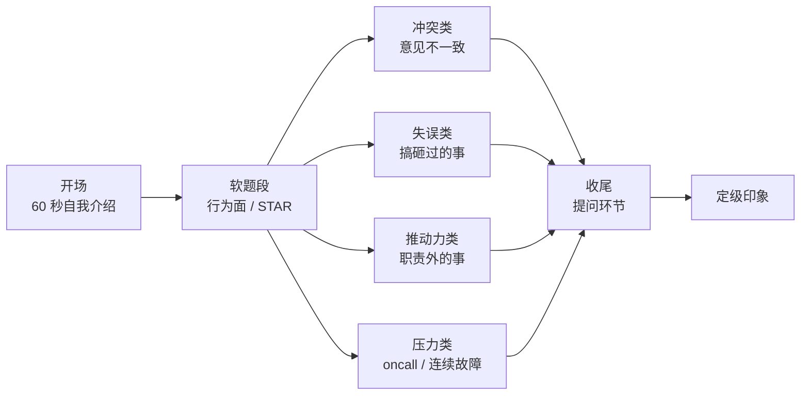
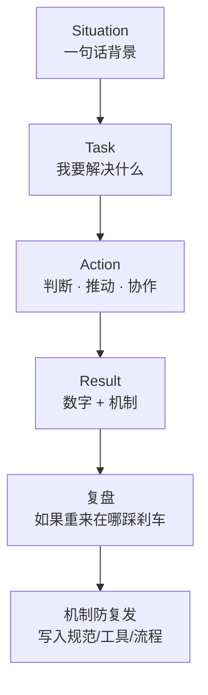

# 04 自我介绍与行为面

> 面试官第一题「先做个自我介绍」——有人背简历背到第三分钟被打断，有人 60 秒讲完就让对方想追问；后面「你搞砸过什么事」「为什么离职」「你有什么问题问我」看似闲聊，其实每题都在给定级打分。
> **本章回答**：一场面试的开场与软题段怎么答——60 秒自我介绍骨架、行为面四类题的 STAR 讲法、收尾提问的加分问法与红线。
> **不讲**：STAR 项目故事的完整打磨 → [01](../01-STAR项目话术/)；复盘深讲 → [09-07](../../09-可观测性与SRE方法论/07-故障管理与复盘/)；谈薪与跳槽话术 → [05](../05-谈薪与红线/)。

**标记**：🎯重点 · 🔥难点 · ⭐常考 · 🔧实操

---

## 一、一张图：一场面试的开场与软题段

> 🎯 **一句话**：开场 60 秒定第一印象，后面每一道软题都在考判断力、ownership、成长性、协作——不是闲聊。



**读图**：

- 主线是「一场面试的时间线」：开场 → 软题段四类题 → 收尾提问，最后汇总成定级印象。
- 自我介绍是入口，决定面试官愿不愿意顺着你的故事追问。
- 四类题不是按顺序问的，但**每题都要回到同一个考察模型**。

---

## 二、开场：60 秒自我介绍是第一印象的 70%

> 🎯 **一句话**：自我介绍不是念简历，而是让对方 60 秒内记住「你是谁、你做过什么、你为什么来这个岗位」。

面试的头 60 秒通常决定了 70% 的第一印象。这不是夸张——面试官在听你讲话的语气、结构、数字可信度，判断你是「有备而来」还是「临场凑数」。结构混乱或超时，会直接压低后面所有回答的信用分。

### 骨架：一句话身份 + 两段经历 + 一个匹配点 + 收尾抛球 ⭐🔥

把 60 秒切成四段，每段都有明确任务：

```text
① 一句话身份（5 秒）：   我是谁，干了多久， focus 在哪
② 两段经历（35 秒）：   每段给一个数字 + 一个可追问的故事钩子
③ 一个匹配点（10 秒）： 为什么是这个岗位 / 这家公司
④ 收尾抛球（10 秒）：   把话题引向自己最准备好的项目
```

**四段拆解**：

- **一句话身份**：不要说「我叫 XX，来自 XX，很高兴参加面试」。直接给职业定位。例：「五年游戏运维，focus 在发布体系、K8s 容器化和 oncall 稳定性。」
- **两段经历**：最多两段，每段配一个**具体数字**和**一个故事钩子**。数字让可信度落地，钩子让面试官有东西可追问。
- **一个匹配点**：说明你为什么投这个岗位。例：「贵组正在做全球化发行，我上一段正好把国服发布体系搬到 AWS，想把这个经验复用过来。」
- **收尾抛球**：把话题交还面试官，同时暗示你准备好的方向。例：「具体项目细节我们可以展开聊，先看您想从哪段问起。」

### 游戏 SRE 完整示范稿

> 📝 **面试**：下面这段控制在 60 秒左右，可以直接改数字用。

```text
「三年游戏 SRE，负责过一款 MMO 从 0 到 1 的运维体系搭建：开服自动化、
K8s 有状态服编排、监控告警和 oncall 值班。峰值 CCU 35 万，区服 120 组，
云是阿里云 + 出海 AWS。上一段最大的成果是把一次开服从 4 小时人工改成 20 分钟
一键完成，失败率从 15% 降到 0；另一次把 P0 故障 MTTR 从 90 分钟压到 25 分钟，
复盘 action 改了 7 个系统。这次看贵组的高级 SRE，是因为你们在推全球化发行和
SLO 体系，我想把发布工程化和稳定性工程的经验带过来。您想先聊哪个项目？」
```

**读稿要点**：

- 「三年」是年限定位；「MMO 从 0 到 1」是领域。
- 两个数字：**20 分钟 vs 4 小时**、**MTTR 25 分钟 vs 90 分钟**——这两个数字是钩，面试官大概率会追问。
- 匹配点：「全球化发行 + SLO 体系」说明你不是海投。
- 抛球：「您想先聊哪个项目」把主动权交回去。

> ⚠️ **别混**：自我介绍不是「个人简介」。不要背籍贯、爱好、大学课程——面试官手里有简历，他要的是**你认为自己最值得被问的三件事**。

### 自我介绍的三个坑 🎯⭐

| 坑 | 表现 | 后果 |
|---|---|---|
| 背简历 | 从第一家公司按时间念到最近 | 面试官打断你，印象分扣光 |
| 没有数字 | 「负责了很多项目」「做了很多优化」 | 听不出规模，无法追问 |
| 超 2 分钟 | 讲到第三分钟还没停 | 被打断，节奏崩掉 |

**怎么改**：

- 背简历 → 改成「两个项目 + 两个数字」。
- 没有数字 → 每个成果前补 CCU、区服数、时间、失败率、MTTR。
- 超时 → 写完稿用手机计时，严格 55–65 秒；面试时戴表看时间。

> 📝 **面试**：如果被打断「行了，我们直接问项目」，不要慌——说明你的简历已经够了，立刻切 STAR 故事。

---

## 三、考察模型：面试官在听什么

> 🎯 **一句话**：行为面不是闲聊，面试官在听你的判断力、ownership、成长性、协作方式——每道题都映射一个考察点。

### 行为面到底在考什么 ⭐

行为面（Behavioral Question）的假设是：**过去的行为是未来表现的最佳预测**。面试官不关心故事本身多精彩，关心的是你在特定情境下怎么做决策、怎么落地、怎么复盘。

四类高频考点：

| 考察点 | 面试官想听 | 典型题 |
|---|---|---|
| **判断力** | 信息不全时你怎么选，依据是什么 | 「如果重来你会怎么做」 |
| **ownership** | 边界模糊的事你敢不敢接，推不推得动 | 「主动做过什么职责外的事」 |
| **成长性** | 失败之后你改了多少，不是认个错 | 「讲一个你搞砸的事」 |
| **协作** | 冲突中你是对事还是对人 | 「和同事意见不一致怎么办」 |

> ⚠️ **别混**：行为面不是「 personality 测试」，也不是「情商测试」。它考的是**可验证的行为模式**——所以每个答案必须带「我当时做了什么、结果是什么数字」。

### STAR 是骨架，不是模板 🔥

STAR（Situation / Task / Action / Result）是行为面答题的通用骨架：

```text
S（背景）：一句话交代项目规模和冲突点，别展开
T（任务）：你要解决什么问题
A（行动）：你具体做了什么——这是答案最厚的部分
R（结果）：数字 + 后续影响
```

但 STAR 容易答成流水账。区别在 A 里要突出：

- **决策依据**：你为什么选 A 而不是 B。
- **阻力与推动**：谁不配合，你怎么说服。
- **复盘与机制**：一次解决不够，还要防止复发。

> 📝 **面试**：答行为面时，A 要占 50% 以上篇幅，R 要带数字，S 和 T 各一句话就够。很多候选人把 80% 时间讲背景， Action 只剩两句——这是定级低的关键原因。

### 软题的回答节奏

```text
0–5s   结论先行：「这件事我学到了 X」或「我的做法是 Y」
5–30s  背景 + 任务
30–70s Action（重点：判断、推动、协作）
70–85s Result（数字 + 机制改进）
85–90s 收尾：「所以后面遇到类似情况，我会……」
```

> 🎯 每道软题都争取在 90 秒内讲完主故事，留时间给追问。

---

## 四、冲突类：和同事意见不一致怎么办

> 🎯 **一句话**：冲突题要答「对事不对人 + 用数据说话 + 机制上防复发」，不是「我赢了」。

这类题考**协作与判断力**。面试官最怕听到两种回答：一种是「我忍过去了」，一种是「我把对方说服了」。前者没主见，后者像争输赢。标准答案要展示你如何把冲突变成更好的决策。

### 答题结构

```text
① 明确分歧点：我们在什么事情上有不同意见，各自立场是什么
② 用数据/实验定方向：不凭嗓门，写个小脚本、做 A/B、翻监控
③ 决策与执行：谁拍板，怎么执行，谁负责什么
④ 机制防复发：把这次冲突沉淀成 checklist / review / 规范
```

### 完整示范：游戏 SRE vs 开发「要不要改发布窗口」

> 📝 **面试**：下面这段可直接背，面试时把数字换成自己的。

```text
「之前我们做战斗服滚动发布，开发组长希望把窗口从凌晨 2 点改到晚上 10 点，
说这样开发不用熬夜。我反对，理由是晚上 10 点是在线高峰。
我们没有争，而是一起跑了三周数据：晚上 10 点发布时玩家掉线率比凌晨 2 点
高 1.8 倍，回滚耗时也多 40 分钟。我把这些数据发到组里，建议保留凌晨窗口，
但把发布前置准备（镜像构建、配置校验）改到白天自动化。
最后窗口保留在凌晨 2 点，但发布准备时间从 2 小时压缩到 15 分钟，
开发也不用熬夜了。之后我们把这个流程写进发布规范，谁再想改窗口必须先过
数据 review。」
```

**读答案**：

- 分歧点清楚：窗口时间。
- 用数据说话：掉线率 1.8 倍、回滚多 40 分钟。
- 不是单纯否定：给替代方案（白天自动化准备）。
- 机制防复发：写入发布规范 + 数据 review。

> ⚠️ **别混**：冲突题不要说「对方不懂技术」或「我情商高把他搞定了」。面试官会默认你私下也是这么评价别人的。

### 冲突题常见追问

- 「如果对方是上级且坚持己见？」——答：我会明确表达风险和数据，然后执行；如果风险是 P0，会再同步一次并留书面记录。
- 「如果数据也不支持你呢？」——答：那就按数据改，承认自己判断错了，并更新认知。

---

## 五、失误类：讲一个你搞砸的事

> 🎯 **一句话**：失误题必须真失误，重点在「我当时判断错了什么、后来流程上怎么改」。

这是**成长性**的核心题。面试官要听的不是「我有多惨」，而是**你从失败中提取了什么系统级改进**。最差的回答是「我没有什么失败」或「失败是因为别人/环境」。

### 答题结构

```text
① 真失误：选一个你确实负主要责任的案例，不美化
② 我当时怎么判断的：为什么当时会做那个决定
③ 止损：发现错了之后第一时间做了什么
④ 流程改进：和复盘会怎么对齐，改了哪些系统/机制
⑤ 现在回看：如果重来，会在哪个节点踩刹车
```

> ⚠️ **别混**：失误题不是「甩锅题」。你可以说环境复杂、信息有限，但**决策和动作必须是你自己做的**。

### 完整示范：一次误操作导致回档

> 📝 **面试**：选一个你真实负责过的 case，下面的口径供参考。

```text
「我主导过一次合服操作，误用了旧的 DB 备份做源，导致合服后 1200 个玩家
数据回退了 6 小时。当时判断错了两个点：一是没校验备份时间戳，二是没做
双人复核。
发现后我立刻停服、拉起备份、通知客服和运营，4 小时内把数据恢复到正确
状态，玩家补偿方案同步上线。复盘会上我认领了主责，推动改了三个机制：
合服脚本强制校验备份时间、关键操作必须双人复核、发布平台增加灰度确认
按钮。之后半年合服 40 多次，零同类事故。
如果重来，我会在执行前加一个 5 分钟『暂停检查』环节，让另一个人独立
确认源和目标。」
```

**读答案**：

- 真失误：用了旧备份，1200 玩家回退 6 小时。
- 判断错误明确：没校验时间戳、没双人复核。
- 止损：停服、恢复、同步补偿。
- 流程改进：三条机制。
- 再回看：加 5 分钟暂停检查。

> 📝 **面试**：这个答案可以直接呼应 [09-07](../../09-可观测性与SRE方法论/07-故障管理与复盘/) 的复盘口径——**先止血、再根因、再改系统、最后验证**。

### 收束：行为面答题的「STAR + 复盘」骨架 🎯⭐

到这儿，冲突和失误两类的核心方法已经出来了。所有软题都可以收束到同一张图：



**读图**：

- 前四步是 STAR，最后两步把答案从「讲故事」升级到「系统改进」。
- **复盘**是分水岭：只讲结果的是执行者，讲出「如果重来」的是有成长性的候选人。
- **机制防复发**是 ownership 的体现：不是修好一次就完，而是让团队以后都不容易再犯。

> 📝 **面试**：答任何行为面题，都可以按这张图自检：Action 有没有占 50%？Result 有没有数字？有没有复盘和机制？缺一块，面试官就少一个给高分的理由。

### 「你最大的缺点」怎么答

> 🎯 **一句话**：答真缺点 + 已改进机制，不要答「我太追求完美」。

「太追求完美」是面试十大烂梗。标准答法是：**给一个真实但不致命的缺点，加你已经建立的改进机制**。

```text
「我过去有个习惯：遇到故障容易先埋头排查，忘了同步进度。
后来我在 oncall 手册里给自己加了一条『5 分钟同步原则』——任何 P1 以上故障，
5 分钟内必须在值班群发一次现状和下一步。现在这条规则也写进了团队 wiki，
上周一次 Redis 异常我 3 分钟就完成了首次同步。」
```

> ⚠️ **别混**：不要给致命缺点（「我抗压能力差」「我容易和同事冲突」），也不要给假缺点（「我太努力」）。选「正在改善的真实习惯」最安全。

---

## 六、推动力类：主动做过什么职责外的事

> 🎯 **一句话**：推动力题要答「发现问题 → 论证价值 → 推动落地 → 度量结果」，不是「我很努力」。

这类题考 **ownership**。面试官想听的是：你看到一个问题，怎么让没有汇报关系的人配合你，怎么在资源不足时推进，最后怎么量化的。

### 答题结构

```text
① 发现什么问题：数据或用户反馈
② 为什么值得做：和业务目标挂钩（发布效率 / 稳定性 / 成本）
③ 阻力在哪：谁不配合 / 缺资源 / 优先级不够
④ 怎么推的：小范围验证 → 拉数据 → 找决策者 → 落地
⑤ 结果：数字 + 是否被复用
```

### 完整示范：推动自动化开服

> 📝 **面试**：下面这个故事适合有发布/开服经验的候选人。

```text
「之前我们开新服全靠人工：运维按 checklist 一台台配，一次开 10 组服要
4 小时，出错率 15%。我发现这个问题后，先做了一个最小 demo：用 Python + 
Ansible 把 3 组服的配置生成和部署自动化，原本 40 分钟的操作 5 分钟跑完。
我把 demo 给发布负责人和开发组长演示，算出如果全量推广，每月能省 36 个
运维工时，还能把失败率压到 1% 以下。
阻力是开发担心自动化脚本覆盖不到特殊配置。我拉着两个开发一起补了 17 条
边界 case，再跑了两轮灰度。两个月后全服推广，单次开 20 组服只要 20 分钟，
失败率降到 0，脚本也被其他项目复用。」
```

**读答案**：

- 发现问题：人工开服慢、错误率高。
- 价值论证：省 36 工时/月、失败率 1% 以下。
- 阻力：开发担心边界 case。
- 推动：补 17 条 case、两轮灰度。
- 结果：20 分钟、失败率 0、被复用。

> 📝 **面试**：推动力题的关键是**让对方看到「不做的代价」**。只讲「我想做」不够，要讲「现在每天浪费多少、出了错代价多大」。

### 推动力题的反面

不要讲这种故事：

- 「我每天加班到很晚」——这是苦劳，不是成果。
- 「我提了很多建议但没人听」——说明你没推动成功。
- 「我一个人全做了」——说明你不会协作。

> ⚠️ **别混**：推动力不是「独狼」，而是**在没有正式权力时，用数据和机制把事情做成**。

---

## 七、压力类：oncall 半夜被叫/连续故障怎么扛

> 🎯 **一句话**：压力题要讲「优先级排序 + 止损动作 + 恢复节奏 + 事后怎么让自己不 burnout」，不讲苦劳。

游戏 SRE 的 oncall 压力大是常态。面试官不是听你诉苦，而是看你有没有**抗压系统和恢复机制**。

### 答题结构

```text
① 先止血：止损第一，定位第二
② 再分级：P0/P1/P2 分别怎么响应
③ 同步节奏：多久同步一次，同步给谁
④ 恢复后：复盘 + 监控补洞
⑤ 个人机制：怎么避免连续高压 burnout
```

### 完整示范：连续三周 P0 的抗压经历

> 📝 **面试**：下面这个故事展示抗压 + 系统性恢复。

```text
「去年春节活动期，我们连续三周出了 4 次 P0：两次 DB 主从延迟导致充值异常，
一次网关雪崩，一次 CDN 回源被打爆。那段时间我基本住在值班群。
我的做法是先立一个『战时规则』：任何 P0，5 分钟内必须在群里发『现状 +
已做动作 + 下一步 + ETA』；30 分钟没定位清楚就升级。
第一次 DB 延迟，我 10 分钟内切到只读 + 限流，充值成功率从 78% 恢复到 99%，
2 小时内定位到慢 SQL。之后我把这 4 次事故的止损动作整理成 oncall 剧本，
并推动在监控里加了 6 条前置告警。
个人层面，我给自己定了『高压后必须休息 24 小时』的规则，和主管申请了
活动期后调休。连续高压不能靠硬扛，要靠轮休和预案把体力留在真正关键的
故障上。」
```

**读答案**：

- 止血：切只读 + 限流，充值成功率 78%→99%。
- 分级：5 分钟同步、30 分钟升级。
- 同步节奏清晰。
- 恢复后：oncall 剧本 + 6 条前置告警。
- 个人机制：高压后 24 小时休息、轮休。

> ⚠️ **别混**：压力题不要说「我熬了三个通宵」或者「我不觉得累」。面试官会担心你 burnout 之后反而成为不稳定因素。

### 抗压和恢复是两个考点

```text
抗压 = 故障中保持清晰：止血 · 分级 · 同步
恢复 = 故障后保护自己：轮休 · 复盘 · 补监控
```

只讲一边都会扣分：只讲抗压像铁人，只讲恢复像逃避。

---

## 八、收尾：提问环节怎么问加分

> 🎯 **一句话**：提问环节是反向面试——问团队故障文化、oncall 轮换、SLO 现状加分；第一句问加班和薪资减分。

面试官让你提问，不是礼节性结束，而是**在考察你对岗位的理解深度和兴趣点**。

### 加分问法

| 问题 | 为什么加分 |
|---|---|
| 「团队现在的 oncall 是怎么轮值的？最近一个季度最严重的故障是什么类型？」 | 显示你关心真实工作状态 |
| 「SLO 现在是怎么定的？错误预算烧完会停发布吗？」 | 显示你懂 SRE 核心概念 |
| 「发布流程里现在最大的痛点是什么？」 | 显示你想解决实际问题 |
| 「这个岗位接下来半年最大的技术挑战是什么？」 | 显示你看长期 |

### 减分问法

| 问题 | 为什么减分 |
|---|---|
| 「加班多吗？」 | 第一面问这个，面试官默认你优先看工作量 |
| 「薪资能给多少？」 | 谈薪去 [05](../05-谈薪与红线/)，不要在技术面/HR 初面直接问 |
| 「我能不能 remote？」 | 除非 JD 写了，否则第一面显得条件优先 |
| 「你们公司是做什么的？」 | 说明你没做功课 |

> ⚠️ **别混**：加班和薪资不是不能问，但**不要在第一面第一句话就问**。先问业务、技术、团队，最后一句再问「关于工作节奏和薪资结构，后面哪个环节聊比较合适」。

### 提问环节的标准收尾

```text
「我想了解三个事：第一，这个岗位接下来半年最大的技术挑战是什么；
第二，团队现在 oncall 轮值和复盘文化是怎样的；第三，SLO 和错误预算
现在有没有在发布流程里落地。另外，关于薪资和加班，后面哪个环节聊比较
合适？」
```

> 📝 **面试**：最后一问把「加班/薪资」轻轻带一下但不追问，既表达关心，又不让面试官觉得你只冲着钱。

---

## 九、作战：常见翻车与决策树

> 🎯 **一句话**：行为面翻车通常不是故事差，而是答成了流水账、甩锅、完人、抱怨四种模式。

### 翻车诊断树

```mermaid
flowchart TD
    A[讲完故事觉得没劲] --> B{面试官表情迷茫?}
    B -->|是| C[流水账<br/>缺少 STAR 重点]
    B -->|否| D{故事里没有"我"?}
    D -->|是| E[甩锅<br/>全是别人/环境的问题]
    D -->|否| F{故事里你全对?}
    F -->|是| G[完人<br/>没有真失败/真缺点]
    F -->|否| H{情绪负面?<br/>前东家/同事全是傻子}
    H -->|是| I[抱怨<br/>把面试当吐槽]
    H -->|否| J[OK，准备追问]
```

**读图**：

- 四种翻车模式的共同点是：**面试官听完之后，不知道你这个人碰到问题会怎么做**。
- 流水账缺结构，甩锅缺 ownership，完人缺真实性，抱怨缺职业成熟度。

### 四种翻车的急救改法

| 翻车模式 | 现象 | 急救改法 |
|---|---|---|
| 流水账 | 背景讲 2 分钟，Action 两句话 | 先说结论，再按 STAR 补，Action 占 50% |
| 甩锅 | 「都是开发/产品/领导的错」 | 改讲「我能控制的部分是什么」 |
| 完人 | 「我没有失败」「我最大的缺点是太追求完美」 | 准备一个真缺点 + 改进机制 |
| 抱怨 | 讲前公司全是问题 | 转讲「我做了什么让情况变好」 |

> 📝 **面试**：如果你发现自己正在抱怨，立刻说「但那段经历让我学会了 X，后来我做了 Y」——把负面经历转成成长证据。

### 行为面红线

> ⚠️ **别混**：行为面有三条红线，碰了就很难救：
> 1. **贬前东家**——面试官会默认你离开后也会贬他。
> 2. **编造经历**——资深面试官追问 3 层就能识破。
> 3. **谈薪越界**——第一面主动开价，显得急且不懂流程。

这三条在 [05](../05-谈薪与红线/) 还会深讲。

---

## 十、收口

### 话术速查 🔧

```text
自我介绍：    身份 + 两段经历（各一个数字） + 匹配点 + 抛球
冲突题：      对事不对人 + 数据说话 + 机制防复发
失误题：      真失误 + 判断错在哪 + 流程改了什么 + 如果重来
推动力题：    发现问题 + 论证价值 + 推动落地 + 度量结果
压力题：      止血 · 分级 · 同步 · 恢复 · 防 burnout
缺点题：      真缺点 + 已改进机制 + 一个近期例子
提问环节：    先问挑战/团队/oncall/SLO，再问薪资/加班该走哪个环节
```

### 面试锚点

| 问 | 30 秒答 |
|---|---|
| 先做个自我介绍 | 身份 + 两段数字 + 匹配点 + 抛球，控制在 60 秒 |
| 和同事意见不一致 | 对事不对人 + 数据实验 + 决策执行 + 机制防复发 |
| 讲一个你搞砸的事 | 真失误 + 判断错在哪 + 止损 + 流程改进 + 如果重来 |
| 主动做过什么职责外的事 | 发现问题 + 价值论证 + 阻力 + 推动 + 数字结果 |
| oncall 高压怎么扛 | 止血/分级/同步 + 个人恢复机制 + 补监控 |
| 你最大的缺点 | 真实非致命缺点 + 改进机制 + 近期例子 |
| 为什么离开上家 | 求成长/新挑战，不贬前东家 |
| 你有什么问题问我 | 挑战/oncall/SLO + 薪资环节礼貌带过 |

### 易错一句话对照

- 自我介绍背简历 → 改成两段经历 + 两个数字
- 故事讲 3 分钟没重点 → 结论先行，STAR 中 Action 占 50%
- 冲突题讲「我赢了」 → 讲「数据让我们做了更好的决策」
- 失误题甩锅 → 讲「我判断错了什么、流程怎么改」
- 推动力题讲加班 → 讲「发现什么问题、推动后数字变成多少」
- 压力题讲苦劳 → 讲「止损动作和恢复机制」
- 完人式缺点 → 真缺点 + 改进机制
- 第一面问薪资 → 留到 [05](../05-谈薪与红线/) 环节
- 抱怨前东家 → 转讲「我学到了什么」
- 提问环节说「没有问题」 → 至少准备三个问题
- 缺点答「太追求完美」 → 十大烂梗；改答真缺点+改进机制+近期例子

### 数字墙

> 自我介绍 **60 秒** · 经历配 **2 个数字** · 冲突/失误/推动力答案控制在 **90 秒** · oncall P0 **5 分钟**首次同步 · 连续高压后至少 **24 小时**恢复 · 提问准备 **3 个问题**

### 口述模板

**【30 秒】**「自我介绍 60 秒四段：一句话身份+两段经历各一个数字+匹配点+抛球。行为面四类——冲突题讲对事不对人+数据+机制防复发；失误题讲真失误+判断错在哪+流程改进+如果重来；推动力题讲发现问题+论证价值+阻力和推动+度量结果；压力题讲止血分级同步+个人恢复+补监控。STAR 骨架 A 占 50%，R 带数字，最后加复盘和机制防复发。」

**【2 分钟】** 沿一场面试的开场与软题段：60 秒自我介绍骨架→行为面考察模型四类（判断力/ownership/成长性/协作）→STAR+复盘骨架图→冲突题完整示范→失误题完整示范（呼应 09-07 复盘口径）→推动力题完整示范→压力题完整示范→提问环节加分问法→翻车诊断树四种模式（流水账/甩锅/完人/抱怨）。

**【常见追问】**

| 追问 | 答法 |
|------|------|
| 自我介绍超时了 | 60 秒四段：身份+两段数字+匹配+抛球；不背简历 |
| 冲突题对方是上级 | 表达风险和数据后执行；P0 风险再同步并留书面记录 |
| 没有失败经验 | 不可能；选一个真失误+流程改进+如果重来 |
| 为什么离职 | 求成长/新挑战；不贬前东家 |

---

## 合上书

- [ ] **口述一节的图**：开场 → 软题段 → 四类题 → 收尾提问 → 定级印象。
- [ ] **默背 60 秒自我介绍骨架**：一句话身份 + 两段经历（各一个数字） + 一个匹配点 + 收尾抛球。
- [ ] **口述自我介绍的三个坑**：背简历、没有数字、超 2 分钟。
- [ ] **口述行为面考察模型**：判断力、ownership、成长性、协作——每题对应哪个点。
- [ ] **口述 STAR + 复盘骨架**：Situation / Task / Action / Result / 如果重来 / 机制防复发。
- [ ] **口述冲突题结构**：对事不对人 + 数据说话 + 机制防复发，给一个带数字的示范。
- [ ] **口述失误题结构**：真失误 + 判断错在哪 + 止损 + 流程改进 + 如果重来，和 [09-07](../../09-可观测性与SRE方法论/07-故障管理与复盘/) 复盘口径呼应。
- [ ] **口述推动力题结构**：发现问题 + 论证价值 + 阻力 + 推动落地 + 度量结果。
- [ ] **口述压力题结构**：止血 + 分级 + 同步 + 恢复 + 防 burnout，不讲苦劳。
- [ ] **口述「你最大的缺点」答法**：真缺点 + 已改进机制 + 近期例子，不答「太追求完美」。
- [ ] **口述提问环节**：加分问（团队故障文化 / oncall 轮换 / SLO 现状）和减分问（第一面直接问加班/薪资）。
- [ ] **口述四种翻车模式与急救**：流水账、甩锅、完人、抱怨。

下一章：[05 谈薪与红线](../05-谈薪与红线/)。项目故事打磨见 [01](../01-STAR项目话术/)。
