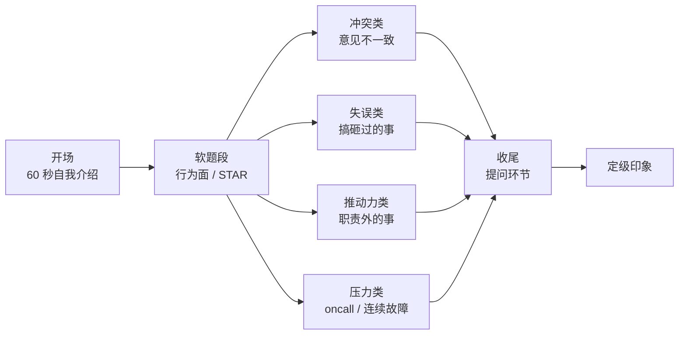
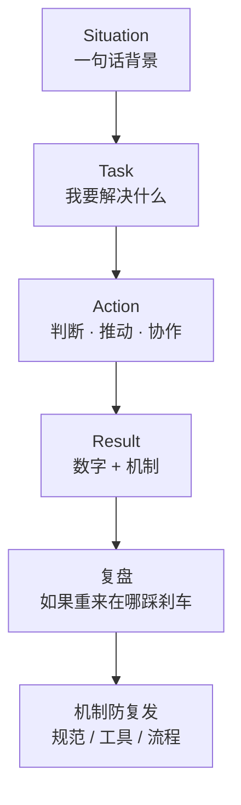
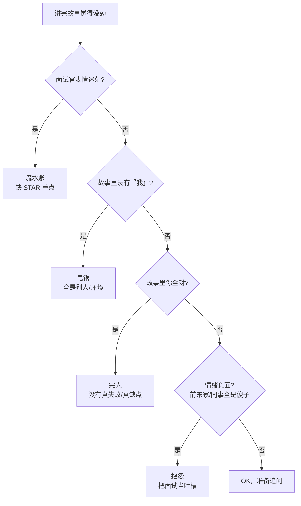

# 自我介绍与行为面

> 面试官第一题「先做个自我介绍」——有人背简历到第三分钟被打断，有人 60 秒讲完对方已经想追问；后面「你搞砸过什么」「为什么离职」「你有什么问题问我」看似闲聊，其实每题都在给定级打分。
> **本章回答**：一场面试的开场与软题段怎么答——60 秒自我介绍骨架、行为面四类题的 STAR+复盘讲法、收尾提问的加分问法与红线。
> **不讲**：STAR 项目故事的完整打磨 → [01](../01-STAR项目话术/)；复盘深讲 → [09-07](../../09-可观测性与SRE方法论/07-故障管理与复盘/)；谈薪与跳槽话术 → [05](../05-谈薪与红线/)。

**标记**：🎯重点 · 🔥难点 · ⭐常考 · 🔧实操
---

## 一、一张图：一场面试的开场与软题段

> 🎯 **一句话**：开场 60 秒定第一印象，后面每一道软题都在考判断力、ownership、成长性、协作——不是闲聊。



- 📖 **读图**
  - 🛤️ 主线是时间线：开场 → 软题四类 → 收尾提问 → 定级印象
  - 🎣 自我介绍是入口，决定对方愿不愿意顺着你的钩子追问；四类题顺序不定，但**每题都回到同一考察模型**

本节对应练习题 Q1、Q14。主线有了——先练 60 秒开场。

---

## 二、开场：60 秒自我介绍

> 🎯 **一句话**：自我介绍不是念简历，而是让对方 60 秒内记住「你是谁、你做过什么、你为什么来」。

- 🧠 头 60 秒通常决定约 70% 第一印象：听的是语气、结构、数字可信度——「有备而来」还是「临场凑数」
- ⭐ 口诀：**「60 秒不是念简历，是抛三个钩子」**

### 🦴 骨架：身份 + 两段经历 + 匹配点 + 抛球 ⭐🔥

```text
① 一句话身份（5 秒）：   我是谁，干了多久，focus 在哪
② 两段经历（35 秒）：   每段一个数字 + 一个可追问的故事钩子
③ 一个匹配点（10 秒）： 为什么是这个岗位 / 这家公司
④ 收尾抛球（10 秒）：   把话题引向自己最准备好的项目
```

- 🪪 **一句话身份**：不要「我叫 XX，很高兴参加面试」——直接给职业定位。例：「五年游戏运维，focus 在发布体系、K8s 容器化和 oncall 稳定性。」
- 🎣 **两段经历**：最多两段；数字落地可信度，钩子留给追问
- 🎯 **一个匹配点**：说明为什么投这个岗。例：「贵组在做全球化发行，我上一段正好把国服发布体系搬到 AWS。」
- 🎾 **收尾抛球**：交还主动权。例：「具体细节我们可以展开，先看您想从哪段问起。」

#### ❓ 为什么不是念简历？

- ❌ **按时间轴背**：面试官手里有简历，第三分钟被打断几乎必然
- ✅ **抛钩子**：两段经历各挂一个数字——对方追问的是你**选出来的**故事，不是全量年表
- ⏱️ **超时 = 信用扣分**：结构混乱或超 2 分钟，会压低后面所有回答的可信度

### 🎮 游戏 SRE 示范稿 📝

> 📝 **面试**：下面这段约 60 秒，改数字即可用。

```text
「三年游戏 SRE，负责过一款 MMO 从 0 到 1 的运维体系搭建：开服自动化、
K8s 有状态服编排、监控告警和 oncall 值班。峰值 CCU 35 万，区服 120 组，
云是阿里云 + 出海 AWS。上一段最大的成果是把一次开服从 4 小时人工改成 20 分钟
一键完成，失败率从 15% 降到 0；另一次把 P0 故障 MTTR 从 90 分钟压到 25 分钟，
复盘 action 改了 7 个系统。这次看贵组的高级 SRE，是因为你们在推全球化发行和
SLO 体系，我想把发布工程化和稳定性工程的经验带过来。您想先聊哪个项目？」
```

- 📖 **读稿**
  - 「三年 / MMO 从 0 到 1」= 年限 + 领域；两个数字钩：**4h→20min**、**MTTR 90→25**
  - 匹配点「全球化 + SLO」说明不是海投；抛球把主动权交回去

> ⚠️ **别混**：自我介绍 ≠ 个人简介。不要背籍贯、爱好、大学课程——他要的是**你认为最值得被问的三件事**。

### 🕳️ 三个坑 🎯⭐

| 坑 | 表现 | 怎么改 |
|---|---|---|
| 背简历 | 从第一家公司念到最近 | 改成「两个项目 + 两个数字」 |
| 没有数字 | 「负责了很多项目」 | 补 CCU / 区服 / 时间 / 失败率 / MTTR |
| 超 2 分钟 | 讲到第三分钟还没停 | 写完稿计时，严格 55–65 秒 |

> 📝 **面试**：若被打断「行了，我们直接问项目」——别慌，说明简历已够，立刻切 STAR（[01](../01-STAR项目话术/)）。

本节对应练习题 Q1、Q2、Q10、Q14。开场外——考察模型。

---

## 三、考察模型：面试官在听什么

> 🎯 **一句话**：行为面不是闲聊——每道题都映射判断力、ownership、成长性、协作之一。

### 🎯 四类考点 ⭐

行为面假设：**过去的行为是未来表现的最佳预测**。对方不关心故事多精彩，关心你怎么决策、落地、复盘。

| 考察点 | 面试官想听 | 典型题 |
|---|---|---|
| **判断力** | 信息不全时怎么选、依据是什么 | 「如果重来你会怎么做」 |
| **ownership** | 边界模糊的事敢不敢接、推不推得动 | 「主动做过什么职责外的事」 |
| **成长性** | 失败后改了多少，不是认个错 | 「讲一个你搞砸的事」 |
| **协作** | 冲突中对事还是对人 | 「和同事意见不一致怎么办」 |

> ⚠️ **别混**：行为面 ≠ personality / 情商测试。它考**可验证的行为模式**——答案必须带「我当时做了什么、结果是什么数字」。

### 🦴 STAR 是骨架，不是填空 🔥

> 💡 **打个比方**：STAR 像剧本场次表——有场次不等于戏好看。A 要有判断、阻力、推动；最后还要加「如果重来 / 机制防复发」。

```text
S（背景）：一句话交代规模和冲突点，别展开
T（任务）：你要解决什么问题
A（行动）：你具体做了什么——答案最厚的部分
R（结果）：数字 + 后续影响
```

- 🔥 **A 里必须露出**：决策依据（为何选 A 不选 B）· 阻力与推动 · 复盘与机制
- ⏱️ **节奏**：0–5s 结论先行 → 5–30s S+T → 30–70s A → 70–85s R（数字+机制）→ 85–90s「以后遇到类似会……」

#### ❓ 为什么 STAR 不够，还要「如果重来」？

- ❌ **只讲 STAR**：像执行者复述一次成功/失败——对方听不出你会不会**再犯**
- ✅ **复盘 + 机制**：在哪个节点踩刹车、写入规范/工具/流程——这才是成长性与 ownership 的证据
- 👉 A 占 **≥50%**；S/T 各一句；R 必须带数字。80% 时间讲背景 = 定级低的常见原因

> 📝 **面试**：答行为面时按「STAR → 如果重来 → 机制防复发」自检，缺一块就少一个高分理由。

本节对应练习题 Q3。模型清了——冲突题。

---

## 四、冲突类：和同事意见不一致

> 🎯 **一句话**：答「对事不对人 + 用数据说话 + 机制防复发」，不是「我赢了」。

### 🗺️ 答题结构

```text
① 明确分歧点：各自立场是什么
② 用数据/实验定方向：小脚本、A/B、翻监控——不凭嗓门
③ 决策与执行：谁拍板、谁负责什么
④ 机制防复发：checklist / review / 规范
```

#### ❓ 为什么不能答「我忍了」或「我说服了他」？

- 😶 **「我忍过去了」** → 没主见，像不会表达风险
- 🏆 **「我把他搞定了」** → 像争输赢；对方会默认你私下也这么评价同事
- ✅ **标准形态**：冲突变成更好决策——数据定方向 + 替代方案 + 机制防复发

### 🎮 示范：发布窗口要不要改 📝

```text
「之前战斗服滚动发布，开发组长希望把窗口从凌晨 2 点改到晚上 10 点，
说开发不用熬夜。我反对，理由是晚上 10 点是在线高峰。
我们没有争，而是一起跑了三周数据：晚上 10 点发布时玩家掉线率比凌晨 2 点
高 1.8 倍，回滚耗时也多 40 分钟。我把数据发到组里，建议保留凌晨窗口，
但把发布前置准备（镜像构建、配置校验）改到白天自动化。
最后窗口保留在凌晨 2 点，发布准备从 2 小时压到 15 分钟，开发也不用熬夜。
之后写入发布规范：谁再想改窗口必须先过数据 review。」
```

- 📖 **读答案**：分歧=窗口时间；数据=掉线 1.8×、回滚+40min；不是单纯否定——给白天自动化；机制=规范+数据 review

> ⚠️ **别混**：不要说「对方不懂技术」或「我情商高搞定了他」。

- 🔍 **追问**
  - 上级坚持？→ 表达风险和数据后执行；P0 风险再同步并留书面记录
  - 数据不支持你？→ 按数据改，承认判断错了，更新认知

本节对应练习题 Q4、Q11。冲突外——失误题。

---

## 五、失误类：讲一个你搞砸的事

> 🎯 **一句话**：必须真失误；重点在「判断错了什么、流程上怎么改」。

### 🗺️ 答题结构

```text
① 真失误：你确实负主要责任，不美化
② 当时怎么判断的：为什么会做那个决定
③ 止损：发现后第一时间做了什么
④ 流程改进：改了哪些系统/机制（对齐复盘口径）
⑤ 如果重来：在哪个节点踩刹车
```

#### ❓ 为什么必须是「真失误」？

- ❌ **「我没什么失败」/「都是别人/环境」** → 成长性直接归零；甩锅缺 ownership
- ✅ **真失误 + 主责**：可以说环境复杂、信息有限，但**决策和动作必须是你自己做的**
- 🔗 口径对齐 [09-07](../../09-可观测性与SRE方法论/07-故障管理与复盘/)：**先止血 → 根因 → 改系统 → 验证**

### 🎮 示范：误用旧备份导致回档 📝

```text
「我主导过一次合服，误用旧 DB 备份做源，导致 1200 个玩家数据回退 6 小时。
当时判断错了两点：没校验备份时间戳；没做双人复核。
发现后立刻停服、拉起备份、通知客服和运营，4 小时内恢复正确状态，补偿方案同步上线。
复盘会上我认领主责，推动三条机制：合服脚本强制校验备份时间、关键操作双人复核、
发布平台增加灰度确认。之后半年合服 40 多次，零同类事故。
如果重来，我会在执行前加 5 分钟『暂停检查』，让另一个人独立确认源和目标。」
```

### 🧩 收束：STAR + 复盘骨架 🎯⭐



- 📖 **读图**
  - 前四步是 STAR；后两步把「讲故事」升级成「系统改进」
  - **复盘**是分水岭：只讲结果=执行者；讲出「如果重来」=有成长性
  - **机制防复发**= ownership：修好一次不够，要让团队以后都不容易再犯

### 🪞 「你最大的缺点」怎么答

> 🎯 **一句话**：真缺点 + 已改进机制；不要答「我太追求完美」。

```text
「我过去有个习惯：遇到故障容易先埋头排查，忘了同步进度。
后来我在 oncall 手册里加了『5 分钟同步原则』——任何 P1 以上，
5 分钟内必须在值班群发现状和下一步。这条也写进团队 wiki，
上周 Redis 异常我 3 分钟完成首次同步。」
```

> ⚠️ **别混**：不要致命缺点（抗压差、爱冲突），也不要假缺点（太努力）。选「正在改善的真实习惯」。

本节对应练习题 Q5、Q6、Q12。失误外——推动力。

---

## 六、推动力类：职责外的事你怎么做成

> 🎯 **一句话**：答「发现问题 → 论证价值 → 推动落地 → 度量结果」，不是「我很努力」。

### 🗺️ 答题结构

```text
① 发现什么问题：数据或用户反馈
② 为什么值得做：挂钩发布效率 / 稳定性 / 成本
③ 阻力在哪：不配合 / 缺资源 / 优先级不够
④ 怎么推的：小范围验证 → 拉数据 → 找决策者 → 落地
⑤ 结果：数字 + 是否被复用
```

#### ❓ 为什么「加班到很晚」不算推动力？

- 😓 **苦劳 ≠ 成果**：加班说明投入，不说明你改变了系统
- 📣 **「提了很多建议没人听」** = 没推动成功
- 🐺 **「我一个人全做了」** = 不会协作
- ✅ **ownership** = 没有正式权力时，用数据和机制把事做成；关键是让对方看见**不做的代价**

### 🎮 示范：推动自动化开服 📝

```text
「之前开新服全靠人工：一次开 10 组服要 4 小时，出错率 15%。
我先做最小 demo：Python + Ansible 把 3 组服配置生成和部署自动化，
原本 40 分钟的操作 5 分钟跑完。演示给发布负责人和开发组长，
算出全量推广每月省约 36 个运维工时，失败率可压到 1% 以下。
阻力是开发担心脚本盖不住特殊配置——我拉两个开发补了 17 条边界 case，
两轮灰度后全服推广：单次开 20 组服 20 分钟，失败率 0，脚本被其他项目复用。」
```

- 📖 **读答案**：问题=慢+错；价值=工时+失败率；阻力=边界 case；推动=补 case+灰度；结果=20min / 0 / 被复用

本节对应练习题 Q7。推动外——压力/oncall。

---

## 七、压力类：oncall 与连续故障怎么扛

> 🎯 **一句话**：讲「优先级 + 止损 + 同步节奏 + 事后防 burnout」，不讲苦劳。

### 🗺️ 答题结构

```text
① 先止血：止损第一，定位第二
② 再分级：P0 / P1 / P2 怎么响应
③ 同步节奏：多久同步一次、同步给谁
④ 恢复后：复盘 + 监控补洞
⑤ 个人机制：怎么避免连续高压 burnout
```

### 🎮 示范：连续三周 P0 📝

```text
「春节活动期连续三周 4 次 P0：两次 DB 主从延迟导致充值异常、一次网关雪崩、
一次 CDN 回源被打爆。我先立『战时规则』：任何 P0，5 分钟内群里发
『现状 + 已做动作 + 下一步 + ETA』；30 分钟没定位清楚就升级。
第一次 DB 延迟，我 10 分钟内切只读 + 限流，充值成功率 78%→99%，
2 小时定位到慢 SQL。之后把 4 次止损动作整理成 oncall 剧本，监控加了 6 条前置告警。
个人层面：高压后必须休息 24 小时，和主管申请活动期后调休——
连续高压不能靠硬扛，要靠轮休和预案把体力留在真正关键的故障上。」
```

```text
抗压 = 故障中保持清晰：止血 · 分级 · 同步
恢复 = 故障后保护自己：轮休 · 复盘 · 补监控
```

> ⚠️ **别混**：只讲抗压像铁人，只讲恢复像逃避；不要说「熬了三个通宵」或「我不觉得累」——对方会担心你 burnout 后成为不稳定因素。

本节对应练习题 Q8、Q9。压力外——收尾提问。

---

## 八、收尾：提问环节怎么问加分

> 🎯 **一句话**：反向面试——问故障文化 / oncall / SLO 加分；第一句问加班和薪资减分。

### ✅ 加分问法

| 问题 | 为什么加分 |
|---|---|
| 「oncall 怎么轮值？最近一季度最严重故障是什么类型？」 | 关心真实工作状态 |
| 「SLO 怎么定？错误预算烧完会停发布吗？」 | 懂 SRE 核心概念 |
| 「发布流程里现在最大的痛点是什么？」 | 想解决实际问题 |
| 「这个岗位接下来半年最大的技术挑战是什么？」 | 看长期 |

### ❌ 减分问法

| 问题 | 为什么减分 |
|---|---|
| 「加班多吗？」 | 第一面默认你优先看工作量 |
| 「薪资能给多少？」 | 谈薪去 [05](../05-谈薪与红线/)，别在技术面/HR 初面直接开价 |
| 「我能不能 remote？」 | 除非 JD 写了，否则像条件优先 |
| 「你们公司是做什么的？」 | 没做功课 |

#### ❓ 为什么第一面不问薪资/加班？

- ⏰ **不是永远不能问**——是**不要第一句就问**
- ✅ 先问业务 / 技术 / 团队；最后一句：「关于工作节奏和薪资结构，后面哪个环节聊比较合适？」
- 📝 标准收尾可背三问：半年挑战 · oncall/复盘文化 · SLO/错误预算是否进发布——再轻轻带薪资环节

本节对应练习题 Q10、Q11（提问侧见 Q8）。提问外——翻车急救。

---

## 九、作战：常见翻车与决策树

> 🎯 **一句话**：行为面翻车通常不是故事差，而是答成了流水账、甩锅、完人、抱怨。



- 📖 **读图**
  - 四种翻车共同点：听完后**不知道你碰到问题会怎么做**
  - 流水账缺结构 · 甩锅缺 ownership · 完人缺真实性 · 抱怨缺职业成熟度

### 🚑 四种翻车急救 🔧

| 翻车 | 现象 | 急救 |
|---|---|---|
| 流水账 | 背景 2 分钟，Action 两句 | 结论先行，STAR 中 A≥50% |
| 甩锅 | 「都是开发/产品/领导的错」 | 改讲「我能控制的部分」 |
| 完人 | 「没有失败」「缺点是太追求完美」 | 真缺点 + 改进机制 |
| 抱怨 | 前公司全是问题 | 转讲「我做了什么让情况变好」 |

> 📝 **面试**：发现自己在抱怨，立刻接「但那段经历让我学会了 X，后来做了 Y」——负面转成长证据。

### 🚫 三条红线

> ⚠️ **别混**：碰了很难救——① **贬前东家**（默认你离开后也会贬他）② **编造经历**（追问 3 层就穿）③ **谈薪越界**（第一面主动开价）。深讲见 [05](../05-谈薪与红线/)。

### ⏱️ 60 秒翻车急救剧本 🔧

```text
0–10s   先停：别继续流水账/抱怨；一句话结论重开
10–30s  补「我」：判断依据 · 我做的动作 · 数字结果
30–45s  若是失误/冲突：补「如果重来」+ 一条机制
45–60s  收口抛球：问对方想追 Action 还是 Result
```

本节对应练习题 Q12～Q14。

---

**回到开头那个现场**：背简历被打断 vs 60 秒抛球；软题答成诉苦或甩锅。正确剧本：60 秒四段骨架 → STAR+复盘 → 对事不对人带数字 → 收尾问故障文化/oncall/SLO。

## 十、收口

### 话术速查 🔧

```text
自我介绍：  身份 + 两段经历（各一个数字） + 匹配点 + 抛球
冲突题：    对事不对人 + 数据说话 + 机制防复发
失误题：    真失误 + 判断错在哪 + 流程改了什么 + 如果重来
推动力题：  发现问题 + 论证价值 + 推动落地 + 度量结果
压力题：    止血 · 分级 · 同步 · 恢复 · 防 burnout
缺点题：    真缺点 + 已改进机制 + 一个近期例子
提问环节：  先问挑战/团队/oncall/SLO，再问薪资该走哪个环节
```

### 面试锚点

| 问 | 30 秒答 |
|---|---|
| 先做个自我介绍 | 身份 + 两段数字 + 匹配点 + 抛球，控制在 60 秒 |
| 和同事意见不一致 | 对事不对人 + 数据实验 + 决策执行 + 机制防复发 |
| 讲一个你搞砸的事 | 真失误 + 判断错在哪 + 止损 + 流程改进 + 如果重来 |
| 主动做过什么职责外的事 | 发现问题 + 价值论证 + 阻力 + 推动 + 数字结果 |
| oncall 高压怎么扛 | 止血/分级/同步 + 个人恢复机制 + 补监控 |
| 你最大的缺点 | 真实非致命缺点 + 改进机制 + 近期例子 |
| 为什么离开上家 | 求成长/新挑战，不贬前东家 |
| 你有什么问题问我 | 挑战/oncall/SLO + 薪资环节礼貌带过 |

### 易错一句话对照

- 自我介绍背简历 → 两段经历 + 两个数字
- 故事讲 3 分钟没重点 → 结论先行，Action ≥50%
- 冲突题讲「我赢了」 → 「数据让我们做了更好的决策」
- 失误题甩锅 → 「我判断错了什么、流程怎么改」
- 推动力题讲加班 → 「发现什么问题、推动后数字变成多少」
- 压力题讲苦劳 → 「止损动作和恢复机制」
- 完人式缺点 /「太追求完美」 → 真缺点 + 改进机制 + 近期例子
- 第一面问薪资 → 留到 [05](../05-谈薪与红线/) 环节
- 抱怨前东家 → 转讲「我学到了什么」
- 提问说「没有问题」 → 至少准备三个问题

### 数字墙

> 自我介绍 **60 秒** · 经历配 **2 个数字** · 冲突/失误/推动力主故事 **≤90 秒** · oncall P0 **5 分钟**首次同步 · 连续高压后至少 **24 小时**恢复 · 提问准备 **3 个问题** · Action 占比 **≥50%**

### 口述模板

**【30 秒】**「自我介绍 60 秒四段：身份+两段经历各一个数字+匹配点+抛球。行为面四类——冲突：对事不对人+数据+机制；失误：真失误+判断错在哪+流程改进+如果重来；推动力：发现问题+论证价值+阻力推动+度量；压力：止血分级同步+个人恢复+补监控。STAR 里 A≥50%，R 带数字，最后加复盘和机制防复发。」

**【2 分钟】** 沿开场与软题段：60 秒骨架 → 四类考察点 → STAR+复盘图 → 冲突/失误/推动/压力各一示范 → 提问加分问法 → 翻车树四种模式。

**【常见追问】**

| 追问 | 答法 |
|------|------|
| 自我介绍超时了 | 60 秒四段；不背简历 |
| 冲突题对方是上级 | 表达风险和数据后执行；P0 再同步并留书面记录 |
| 没有失败经验 | 不可能；选真失误+流程改进+如果重来 |
| 为什么离职 | 求成长/新挑战；不贬前东家 |

---

## 合上书

- [ ] **口述主图**：开场 → 软题段 → 四类题 → 收尾提问 → 定级印象
- [ ] **默背 60 秒骨架**：身份 + 两段经历（各一个数字） + 匹配点 + 抛球
- [ ] **口述三个坑**：背简历、没有数字、超 2 分钟
- [ ] **口述考察模型**：判断力 / ownership / 成长性 / 协作
- [ ] **口述 STAR + 复盘**：S/T/A/R → 如果重来 → 机制防复发
- [ ] **口述冲突题**：对事不对人 + 数据 + 机制，带一个数字示范
- [ ] **口述失误题**：真失误 + 判断错在哪 + 止损 + 流程改进 + 如果重来（对齐 [09-07](../../09-可观测性与SRE方法论/07-故障管理与复盘/)）
- [ ] **口述推动力题**：发现问题 + 论证价值 + 阻力 + 推动 + 度量
- [ ] **口述压力题**：止血 + 分级 + 同步 + 恢复 + 防 burnout
- [ ] **口述缺点答法**：真缺点 + 已改进机制 + 近期例子
- [ ] **口述提问**：加分问（故障文化/oncall/SLO）vs 减分问（第一面薪资/加班）
- [ ] **口述四种翻车**：流水账 / 甩锅 / 完人 / 抱怨 + 急救

下一章：[05 谈薪与红线](../05-谈薪与红线/)。项目故事打磨见 [01](../01-STAR项目话术/)。
