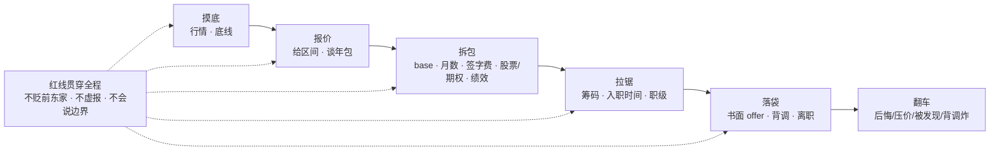
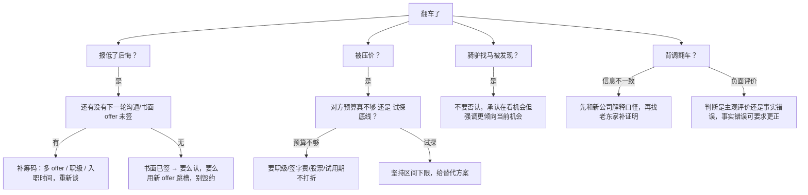

# 谈薪与红线

> 大家好，欢迎来到这次分享。开讲之前，先带大家回到一个很多同学都经历过的现场：
> 面试全过、HR 一个电话却谈崩；或者 offer 到手、背调一通前同事说错话，到嘴的鸭子飞了。
> 这一章讲完，你会知道谈崩和背调翻车各自踩在哪条红线上，以及年包该怎么拆清楚。
> **本章回答**：从第一次聊期望薪资到签 offer、提离职，每个阶段该说什么、不该说什么，怎么把年包谈清楚又不踩红线。
> **不讲**：STAR 项目话术 → [01](../01-STAR项目话术/)；行为面与自我介绍 → [04](../04-自我介绍与行为面/)。这些都有专门的章节，本章只在用到时点到为止。

**标记**：🎯重点 · 🔥难点 · ⭐常考 · 🔧实操

**怎么听这场分享**：咱们先看第一节「offer 的一生」，把摸底 → 报价 → 拆包 → 拉锯 → 落袋装进脑子；红线全程伴随；翻车节拆报低、被压价、骑驴找马、背调翻车。每一节讲完都会提示对应练习题。

---

## 一、一张图：offer 的一生 + 红线

> 🎯 **一句话**：谈薪不是最后那一通电话，而是从 HR 第一次问期望薪资就开始了；红线从简历关一直跟到背调结束。



**读图**：

- 主线是一条 offer 的生命周期，五个阶段依次展开；每个阶段都叠加同一条「红线」——不是只在谈钱时才讲究。
- 翻车节是决策树，当摸底不足、报价太硬、口径不一致时，直接回到对应阶段补动作。


练习题 Q1、Q14。主线有了——先摸底行情与底线。

---

## 二、摸底：行情从哪来，底线怎么算

> 🎯 **一句话**：报数前先知道自己值多少、能低到哪——行情决定上限，个人现金流决定下限。

### 行情三源

**同行交流**是最准的。同样工作五年、同样规模的游戏公司，不同项目奖金差异可能让年包差出十万。重点问结构：对方拿的是 base 还是奖金占比高？签字费是几年摊？股票是期权还是 RSU？

**招聘软件**给的是区间中位，不是真实成交。很多岗位挂 30–50K，实际预算 35K；也有岗位挂得低，但缺人时能给到上限。它最大的作用是看「同一城市同一职级」的分布，不是直接当报价。

**Offershow / 脉脉 / 牛客**是匿名成交价，胜在真实、输在抽样偏差。高薪更愿意晒，低薪沉默；同一公司不同事业部可能差一档。用法是拉一个「同年限同城市」的区间，取 25 分位当底线参考、75 分位当目标参考。

> 💡 **打个比方**：摸底就像打副本前先看掉落表——你知道 BOSS 能出到什么级别，才好决定这把要不要 roll。

### 底线怎么算

底线不是「比现在多一点」，是「覆盖我接下来 12 个月刚性支出的现金流」。

```text
底线年包 ≈ （房贷/房租 + 家庭支出 + 社保自缴 + 应急储备摊到年） × 1.2
```

乘以 1.2 是因为新公司试用期可能打八折、奖金第一年可能按比例发放、搬家/换城市有额外成本。如果 offer 接近这个数，进去后你会很被动，谈判空间也小。

区间设置：下限 = 底线 + 10%，上限 = 目标价位。下限是给 HR 的「能谈」，上限是给自己留的「超预期」空间。

> 📝 **面试**：HR 电话里问你「现在方便聊一下期望吗」，不要直接报数。先反问结构：「我想先了解下这个岗位的薪资结构，是 base 为主还是奖金/股票占比大？年包范围大概多少？」


练习题 Q1、Q2。摸底外，报价三原则。

---

## 三、报价：给区间，谈年包

> 🎯 **一句话**：给区间不报死数，按年包不按月薪，先了解结构再报价。

### 为什么给区间不给死数

报死数等于自断退路。你报 35K，对方预算 40K，你不会知道；你报 35K，对方预算 32K，你连 33K 都没法谈。

区间写法：「结合岗位预算和我的现状，期望年包 40–50 万，具体想先了解下薪资结构。」

- **上限 50 万**是你的目标价位，也是给 HR 的锚。
- **下限 40 万**不是你的真实底线，是底线 + 10% 的「可谈起点」。真实底线藏在心里，不告诉任何人。
- 留一句话「想先了解下薪资结构」，把皮球踢回去，避免在信息不全时先亮底牌。

> ⚠️ **别混**：区间下限不是「最低接受价」，是「我愿意继续认真谈的门槛」。真正的底线只在你自己那张现金流表里。

### 为什么谈年包不谈月薪

月薪相同的两个人，年包可能差一倍。差异来自：

- **月数**：12 个月 vs 15 个月 vs 18 个月。
- **绩效奖金**：有没有？占多少？达成率历史如何？
- **签字费**：一次性还是分年？退还要不要还？
- **股票/期权**：归属周期几年？行权价多少？

> 💡 **打个比方**：HR 说「我们 base 比上家高 20%」听着很香，但如果上家 16 薪、这家 12 薪，年包其实没涨。

**反例算式**：

```text
A 公司：base 25K × 16 个月 = 40 万
B 公司：base 28K × 12 个月 = 33.6 万

HR 说 "base 高 12%"，实际年包少了 6.4 万。
```

另一个更隐蔽的坑：

```text
"总包 40 万" 拆开可能是：
  base 20K × 12 = 24 万
  绩效 6 万（按 100% 达成，历史平均 70%）= 实发 4.2 万
  股票 8 万（分 4 年归属，第一年只拿 25%）= 2 万
  签字费 3.8 万（入职一次性，离职按比例退还）

第一年实际到手现金 ≈ 24 + 4.2 + 2 + 3.8 = 34 万，不是 40 万。
```

所以报价口径统一成：**期望年包 X–Y 万，按 cash + 确定可归属的部分计算**。对方报月薪，你要本能地乘以月数、加上奖金，反推年包。

### 先了解结构再报价

HR 如果坚持让你先开口，你可以用这句话争取信息：

```text
「我想先了解一下咱们这边的薪资结构，比如 base 是多少薪、绩效奖金的考核周期和历史上达成率大概什么水平、有没有签字费或股票。这样我报的数会更有参考性。」
```

如果对方仍然不答，再抛区间。记住：**谁先给具体数字，谁就失去锚定权**。但一直不给会显得没诚意，所以区间是折中。

大家想想：HR 追问「你到底要多少」，报一个死数会怎样？锚定被锁死。⭐ 口诀：**「给区间不报死数，按年包不按月薪」**。

> 📝 **面试**：电话中被追问「你到底要多少」，标准回答：「我期望年包在 45–55 万之间，具体看 base 和奖金的结构。如果奖金占比高，我需要了解绩效考核的达成率历史。」


口诀：**「给区间、谈年包、先问结构」**。练习题 Q3、Q4。报价外，拆包。

---

## 四、拆包：年包结构

> 🎯 **一句话**：年包不是 base 乘 12，是一份由现金流、承诺、风险共同组成的组合；不拆开看就是裸签。

### base × 月数

**base 是现金流的安全垫**。同样年包，base 占比越高越稳；奖金/股票占比越高，离职成本越高、第一年兑现越少。

🔥 高频错答：听见「40 万总包」就签。大白话：**先拆 base×月数、绩效达成率、签字费退还、股票归属**——总包漂亮、base 只有 20K×12 的坑见数字墙。

**月数坑**：

- 12 薪 + 年终奖 3 个月 ≠ 15 薪。年终奖看公司业绩和个人绩效，可能打折。
- 15 薪如果写进 offer，问清楚是「固定 15 薪」还是「12 薪 + 浮动 3 薪」。
- 试用期工资怎么算？很多公司试用期八折，或者不发绩效。

### 绩效奖金

问三个问题：

1. 绩效是季度还是年度？
2. 历史上团队平均达成率是多少？个人绩效分布如何？
3. 绩效系数有没有上限和下限？比如 0.6–1.5。

如果对方只说「理论上 100%」，把「理论上」当 70% 估比较安全。

### 签字费

签字费是现金，但常带退还条款：

- 入职一年内离职，是否全额退还？
- 是按月摊销退还，还是只要离职就全退？
- 是税前还是税后？

> ⚠️ **别混**：签字费不等于年终奖提前发。有的公司把签字费当「买断你年终奖」的钱，你拿了签字费，当年年终奖就没了。

### 股票 / 期权

**RSU（限制性股票）** 和 **期权（Stock Option）** 是两种东西：

- **RSU**：公司直接送你股票，归属后就是你的。价值 = 归属时股价 × 股数。风险是股价跌，但至少有价。
- **期权**：给你一个未来以约定价格（行权价）买股票的权利。价值 = （未来股价 − 行权价）× 股数。如果未来股价低于行权价，期权可能一张废纸。

都要问：

- 归属周期几年？常见 4 年，第一年 25% 或者按季度/月归属。
- 离职后未归属部分怎么处理？通常作废。
- 行权窗口期多久？离职后有没有 90 天必须行权的规定？
- 公司上市计划或回购政策？未上市公司期权流动性很差。

### 五险一金基数

年包里最容易被忽略的部分。base 高但公积金按最低基数交，差距显著：

```text
base 30K，公积金 12%：
  按 30K 基数：公司月缴 3600，年缴 43200
  按 5000 基数：公司月缴 600，年缴 7200

差额 = 36000/年，也是收入的一部分。
```

医保、社保、年金同理。谈薪时可以把「五险一金基数」作为年包的隐性补充项提出来。

### 薪资结构拆解清单

把下面这张清单当成 offer 核对表：

```text
□ base：金额、月数、试用期是否打折
□ 绩效奖金：周期、达成率历史、系数范围
□ 签字费：金额、退还条款、税前/税后
□ 股票/期权：类型、数量、行权价、归属周期、离职处理
□ 五险一金：基数、比例
□ 补贴：餐补、交通、通讯、异地搬迁
□ 假期、体检、培训等软福利
```

> 📝 **面试**：被问「为什么总包 40 万你却嫌 base 低」，答：「我更看重 base 占比，因为它决定每月现金流和五险一金基数。奖金和股票我会按归属周期和风险折价计算。」


⭐ base/奖金/签字费/股票。练习题 Q5、Q6。拆清了，拉锯筹码。

---

## 五、拉锯：筹码与话术

> 🎯 **一句话**：谈判的筹码排序是「多个在谈 offer > 稀缺技能 > 入职时间配合度」，但话说出来要留退路。

### 筹码排序

**多个在谈 offer**：这是最强筹码，但用法不是「你们不给 X 我就去别家」。正确用法是证明市场价位：「我目前还有两家在流程中，给出的年包区间都在 50 万左右，所以想确认一下咱们这边的整体 package 是否在这个范围。」

**稀缺技能**：云原生、出海、K8s 游戏服、混合云、SLO 体系建设、容量模型——这些如果正好是对方缺的，可以拿出来当锚点。要落到项目结果，不是空口说「我会 K8s」。

**入职时间配合度**：急招岗，你能提前入职是筹码；非急招岗，这个筹码价值不大。用法：「如果 package 合适，我可以把离职交接压缩到一个月内。」

### 多 offer 的诚实说法

```text
「我目前还有两家在流程后期，其中一家已经给了口头 offer。我对贵司的岗位更感兴趣，但也需要综合考虑 package 和职业方向。」
```

这句话做了三件事：

1. 暗示你有市场价位，但不点名公司。
2. 表达你倾向对方，留面子。
3. 把筹码引回「package + 方向」，而不是单纯比价。

> ⚠️ **别混**：不要说「A 公司给我 55 万，你们跟不跟」。一来可能触碰保密协议，二来 HR 会质疑你的稳定性。说「区间在 50 万左右」就够了。

### 入职时间不是万能筹码

提前入职只对两类岗位有效：

- 项目急缺人，你来了就能救火。
- 招聘 HC 月底/季度底要关闭。

普通岗位你提前两周入职，可能只换到「那我们加快流程」。别为了表现配合度把话说死。

### 谈职级而不是只谈薪资

如果 HR 说薪资到顶了，可以转攻职级：

```text
「如果当前职级的 base 上限是 35K，那下一个职级的区间大概是多少？我是否可以通过面试定级来争取？」
```

职级上去，base、奖金、股票都会水涨船高；而且职级是长期收益，下次跳槽也是锚。

### 每轮话术示范

**第一轮 · HR 电话初筛**：

```text
HR：「你的期望薪资是多少？」
你：「结合岗位预算和我目前的总包，我期望年包在 45–50 万之间。也想先了解一下这个岗位的薪资结构，是 base 为主还是奖金/股票占比较高？」
```

**第二轮 · 技术面后 HR 跟进**：

```text
HR：「面试官反馈很好，我们想推进下一轮。你现在的薪资流水方便提供吗？」
你：「流水这部分我可以按公司要求提供，不过我更希望咱们先就年包区间达成大致一致，再进入具体材料环节。」
```

**第三轮 · offer 阶段压价**：

```text
HR：「我们 base 最多只能给到 32K。」
你：「32K 比我的预期低一些。除了 base 之外，是否可以在签字费、股票或者职级上做一些平衡？另外绩效奖金的达成率历史能给我个参考吗？」
```

> 📝 **面试**：压价时不要只说一句「太低了」，要给出替代方案。谈判是交换，不是对抗。


练习题 Q7、Q8。拉锯外，落袋顺序。

---

## 六、落袋：口头到书面

> 🎯 **一句话**：口头 offer 不算 offer，书面 offer 不核对清楚就签字，等于把风险全揽过来。

### 口头 offer 不算数

大家想想：HR 说「就这么定了」能不能立刻提离职？很多人会答「能，反正谈妥了」——**错了**。口诀：**「书面核对 → 再提离职 → 背调口径统一」**。

HR 电话里说的「我们给你 45 万」「老板批了」都不算法律约束力。可能发生：

- HC 冻结，口头 offer 撤回。
- 老板换人，薪酬包重批。
- HR 记错数字。

**正确动作**：感谢 + 确认 + 要书面。电话里可以说：「太好了，麻烦把 offer 细节邮件/系统发我，我核对后尽快回复。」

### 书面 offer 核对清单

拿到书面 offer 不要先激动，逐项核对：

```text
□ 岗位名称
□ 职级
□ 汇报对象 / 部门
□ base 金额与月数
□ 绩效奖金规则与考核周期
□ 签字费金额与退还条款
□ 股票/期权：类型、数量、行权价、归属周期
□ 五险一金基数与比例
□ 入职时间与试用期时长
□ 竞业协议范围与补偿标准
□ 工作地点与是否支持远程/异地
□ 报到所需材料清单
```

任何与之前沟通不一致的地方，先邮件确认，再签字。尤其是「口头说 15 薪、书面写 13 薪 + 浮动 2 薪」这种文字游戏。

### 背调口径

背调之前，统一口径，避免前同事、HR、主管说的和你简历/面试说的不一致。

要统一的信息：

- 入职/离职时间。
- 职级和汇报对象。
- 离职原因（见七节）。
- 是否签过竞业协议、是否正在履行。

提前联系 2–3 个背调人，告诉他们：「最近可能有背调联系你，麻烦帮我确认一下在职时间和岗位信息。」不需要他们帮你吹牛，只需要他们不拆台。

### 提离职的时机

**书面 offer 签字后，再提离职**。顺序反了风险巨大：

- 口头 offer 可能被撤回。
- 背调可能出问题。
- 新公司可能调整入职时间。

提了离职之后，不要立刻摆烂。交接做好、口碑保住——新公司背调可能在你离职后还联系老东家。

> 📝 **面试**：HR 催你「先提离职我们再走流程」，答：「我理解流程需要推进，但我这边的原则是拿到书面 offer 后再启动离职交接，这样对双方都稳妥。」


口诀：**「书面核对后再提离职」**。练习题 Q9。落袋外，红线清单。

---

## 七、红线：贯穿全程

> 🎯 **一句话**：面试里说的每一句话都会留下痕迹；红线不是道德口号，是自我保护。

### 不贬前东家

离职原因口径三选一，每句都要能落地：

- **发展瓶颈**：「前公司业务稳定，但我在技术深度/管理宽度上已经到了天花板，想找一个更能发挥 SRE 体系化能力的平台。」
- **业务方向**：「前公司业务重心转向 XX，我想继续深耕游戏运维/SRE 这个方向，贵司的项目更匹配。」
- **家庭/城市**：「家庭原因需要换城市/减少出差，所以选择看本地机会。」

> ⚠️ **别混**：吐槽前司、领导、同事，面试官会本能地代入自己——「你以后会不会也这么说我？」负面评价前东家不是真诚，是风险。

### 不撒谎不虚报

最容易翻车的三个点：

- **薪资流水**：报高流水然后 P 图，背调一查银行/社保就露馅；部分公司会让候选人授权查个税 APP。
- **项目夸大**：说「我负责过千万级 DAU」其实只参与过其中一小部分，追问三层就崩。
- **职级虚报**：P7 说 P8，背调时老东家 HR 一句「他是 P7」直接炸。

虚报的收益是几千块月薪，成本是整个 offer 作废并可能进黑名单。

### 不会就说边界，再给推理

技术面试红线：承认不知道，但给出边界和推理。三个场景示范：

**场景 1 · 没实操过**

```text
「这个功能我线上没有直接操作过。按我的理解，它应该是在 X 组件里做 Y 配置，然后 Z 来做一致性校验。如果我落地，会先在小环境里验证回滚路径。」
```

**场景 2 · 只知概念**

```text
"etcd 的 raft 细节我没读过源码，但我知道它用多数派提交来保证一致性； leader 挂了会触发选举，期间写请求会卡住。实际排查我会先看 member list 和日志里的任期变化。"
```

**场景 3 · 被追问到极限**

```text
"这个点我确实没研究到这么深，我目前的边界是……再往下可能是 X 原理，但我不确定，回去会补一下。"
```

> 📝 **面试**：面试官要的不是全知，是「知道就是知道、不知道能诚实说明边界、并且能用已知推导未知」的工程思维。

### 不透露现公司机密

面试中举例说明项目时，把敏感信息脱敏：

- 不说具体营收、DAU、分成比例，改成「千万级 DAU」「头部项目」。
- 不说内部架构细节，尤其是安全、风控、反作弊。
- 不带内部文档、代码、配置截图出门。

对方如果追问「你们公司那个 XX 事故怎么处理」，你可以答：「这类故障的处理思路我可以分享，但具体数据属于公司内部信息，不方便透露。」

### 薪资流水能不能给

可以按公司流程提供，但要注意：

- 提供范围：近 6 或 12 个月银行流水 / 个税 / 社保。
- 如果有未入职部分的奖金、股票未归属，主动说明：「流水只反映已发放部分，去年还有 X 万年终奖 / 股票未体现在流水中。」
- 如果新公司要求你提供上家 offer 截图来证明报价，可以拒绝：「这是我的个人信息，不太方便提供。」

### 竞业协议一句

游戏行业竞业常见，签之前问清：

- 竞业范围写得多宽？是列明公司还是「同行业」?
- 补偿标准是多少？通常不低于离职前 12 个月平均工资的 30%。
- 补偿发几个月？是否按月发？
- 入职新公司前，原公司有没有启动竞业？有没有发第一笔补偿？

> 📝 **面试**：如果新公司担心你有竞业，主动说明：「我离职时和公司确认过，没有启动竞业/竞业范围不包含贵司，如有需要我可以提供相关沟通记录。」


⭐ 不贬前东家、不虚报、不泄密。练习题 Q10、Q11。红线外——翻车急救。

---

## 八、翻车：决策树

> 🎯 **一句话**：谈判中 80% 的翻车不是行情差，是情绪驱动下的误判；先定型，再回对应阶段补救。



**读图**：

- 报低后悔，关键看「书面签了没」。没签可以补筹码重谈；签了再毁约成本极高。
- 被压价要先判断是预算问题还是谈判试探，两种情况的回应不同。
- 背调翻车分两类：信息不一致（时间、职级）可以补材料；负面评价（前同事说坏话）只能事前预防。

### 报低了后悔

如果口头 offer 还没发，立刻补一封邮件/消息：

```text
「关于薪资，我回去整理了一下目前手上的机会和个人情况，期望年包调整为 48–55 万。主要原因是另外一家在流程中的岗位 package 落在这个区间，同时我也更看好贵司的方向，希望能在双方都觉得合理的前提下推进。」
```

调整要讲理由，不能只说「我想多要点」。

### 被压价

压价常见三种：

- **预算真不够**：看能不能换签字费、股票、职级。
- **试探底线**：坚持区间下限，同时抛出替代方案。
- **你的报价超预算太多**：如果对方说「我们只能给 35 万」，而你期望 55 万，差距 20 万——这通常不是压价，是岗位预算不匹配，要考虑是否还要硬谈。

### 骑驴找马被发现

不要撒谎。被发现时标准口径：

```text
「我确实在看几个机会，行业里有合适的岗位我都会了解。但贵司的项目方向、技术栈和团队是我最看好的，所以也把这边作为优先推进的。」
```

否认只会让对方觉得你更不坦诚。

### 背调翻车

- **时间/职级对不上**：先和新公司 HR 解释差异原因（比如试用期转正后职级调整、内部调岗等），提供劳动合同、离职证明、社保记录佐证。
- **前同事负面评价**：如果是事实错误，联系原公司 HR 或更高级别主管出具说明；如果是主观差评，看新公司是否愿意听你解释。预防 > 补救。


练习题 Q12～Q14。现在回开头那个现场。

---

**回到开头那个现场**：电话谈崩、背调说错话鸭子飞了。正确剧本是：区间年包 → 拆包算清楚 → 书面核对 → 再提离职 → 背调口径统一；红线全程不碰。现在再看「先口头答应再慢慢谈」，你知道该怎么拦住自己了。

## 九、收口

### 话术速查 🔧

```text
摸底阶段
  「我想先了解一下这个岗位的薪资结构，base、奖金、股票、签字费大概怎么配？」

报价阶段
  「结合岗位预算和我的现状，期望年包 X–Y 万，具体想先了解下薪资结构。」

压价阶段
  「这个 base 低于我的预期，除了 base 之外，是否可以在签字费、股票或职级上做平衡？」

多 offer 阶段
  「我目前还有两家在流程后期，给出的年包区间都在 50 万左右，我也想确认一下贵司的 package。」

背调前
  「我离职时和公司确认过没有启动竞业，相关沟通记录可以提供。」

入职催促
  「我会拿到书面 offer 后再启动离职交接，这样对双方都稳妥。」
```

### 面试锚点

遮住右列自问自答，卡壳的行回去重读对应小节——能讲出来才算会：

| 问 | 30 秒答 |
|----|---------|
| 你的期望薪资是多少？ | 给区间：年包 X–Y 万；先了解薪资结构。 |
| 为什么给区间不给死数？ | 区间上限是目标，下限是谈判起点；死数会自断退路。 |
| 谈年包还是谈月薪？ | 谈年包。月薪相同，年包可能差很多（月数、奖金、股票）。 |
| 年包怎么拆？ | base×月数 + 绩效达成率 + 签字费退还条款 + 股票归属周期与行权价 + 五险一金基数。 |
| 为什么要先了解结构再报价？ | 避免信息不对等时报低或报高；结构决定真实到手。 |
| 多 offer 怎么谈？ | 诚实说「还有在流程中的机会」，但不点名、不晒截图，用来锚定市场价位。 |
| 入职时间能当筹码吗？ | 只对急招岗有效；不要为表现配合度把话说死。 |
| 口头 offer 可信吗？ | 不可信。拿到书面 offer 再提离职。 |
| 书面 offer 要核对什么？ | 岗位、职级、base、月数、奖金规则、股票/期权、签字费、五险一金、入职时间、竞业条款。 |
| 薪资流水能不能给？ | 按流程给，但补充说明年终奖/股票等未体现部分。 |
| 离职原因怎么说？ | 发展瓶颈 / 业务方向 / 家庭；不贬前东家。 |
| 技术点不会怎么办？ | 说边界，再给推理：「我没实操过，但按 X 原理推断……」 |
| 前同事背调说坏话怎么办？ | 事前统一口径 > 事后补救；事实错误可要求更正。 |
| 竞业要注意什么？ | 范围、补偿标准、发放周期、是否已启动。 |

### 易错一句话对照

- 报死数 → 给区间，留锚点和退路。
- 只谈月薪 → 谈年包，拆结构。
- 口头 offer 就提离职 → 书面 offer 签字后再提。
- 被压价只说「太低了」 → 给替代方案（职级/签字费/股票/试用期）。
- 吐槽前东家 → 离职原因三选一，永远正面表述。
- 薪资流水 P 图 → 一查就炸，直接黑名单。
- 项目夸大 → 追问三层就崩。
- 不会就硬编 → 说边界，再给推理。
- 透露现公司机密数据 → 脱敏处理，用「千万级」「头部项目」替代。
- 竞业没看清就签 → 问清范围、补偿、周期、是否启动。
- 骑驴找马被发现就否认 → 承认在看，但强调倾向当前机会。
- 背调翻车再联系前同事 → 事前统一口径更重要。
- 入职催一下就提前离职 → 书面 offer 不签，风险自担。

### 数字墙

> 期望薪资给 **区间** 而非死数 · 谈 **年包** 而非月薪 · 年包 = **base × 月数 + 绩效 + 签字费 + 股票/期权 + 隐性五险一金** · 区间下限 ≈ 真实底线 + **10%** · 试用期常见 **6 个月**、工资可能 **八折** · 股票归属常见 **4 年**，第一年 **25%** · 竞业补偿通常 ≥ 离职前平均工资 **30%** · 背调前至少统一 **3 位** 口径人 · 书面 offer 核对清单 **11 项**

---

## 合上书

学到这里，先别急着翻下一章。合上书，试试下面这几件事——卡住就回对应小节：

- [ ] **口述一节的图**：offer 一生五阶段（摸底 → 报价 → 拆包 → 拉锯 → 落袋）+ 红线全程伴随 + 翻车回到对应阶段。
- [ ] **口述报价三原则**：给区间不报死数、按年包不按月薪、先了解结构再报价。
- [ ] **口述年包拆法**：base×月数、绩效达成率历史、签字费退还、股票/期权归属与行权价、五险一金基数，给「40 万总包 base 只有 20K×12」的反例算式。
- [ ] **口述筹码排序**：多个在谈 offer > 稀缺技能 > 入职时间配合度；多 offer 诚实但不点名的话术。
- [ ] **口述落袋顺序**：口头 offer 不算数 → 书面 offer 逐项核对 → 签字后再提离职 → 背调前统一口径。
- [ ] **口述离职原因三口径**：发展瓶颈、业务方向、家庭；每个给一句话术，不贬前东家。
- [ ] **口述技术不会答法**：「这个我没实操过，但按 X 原理我推断……」给三个场景示范。
- [ ] **口述红线清单**：不贬前东家、不虚报、不透露机密、流水按流程给、竞业问清四要素。
- [ ] **口述背调翻车处理**：信息不一致补证明、负面评价事前预防；统一 2–3 个背调人口径。
- [ ] **口述翻车决策树**：报低后悔（书面签了没）、被压价（真不够还是试探）、骑驴找马被发现（不否认）、背调翻车（分类处理）。

下一章：[自我介绍与行为面](../04-自我介绍与行为面/)。项目话术：[01](../01-STAR项目话术/)。
