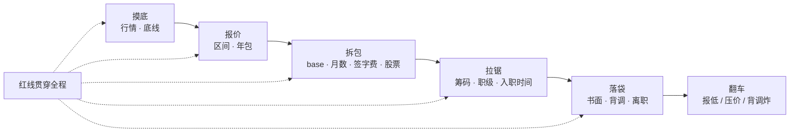
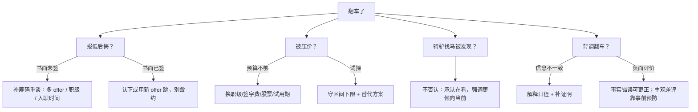

# 谈薪与红线

> 面试全过、HR 一通电话谈崩；offer 到手、背调一通前同事说错话——到嘴的鸭子飞了。有人喊「先口头答应再慢慢谈」，有人喊「先提离职催他们发书面」，两句都踩雷。
> **本章回答**：从第一次聊期望到签 offer、提离职，每个阶段该说什么、不该说什么，怎么把年包谈清楚又不踩红线。
> **不讲**：STAR 项目话术 → [01](../01-STAR项目话术/)；行为面与自我介绍 → [04](../04-自我介绍与行为面/)。

**标记**：🎯重点 · 🔥难点 · ⭐常考 · 🔧实操
---

## 一、一张图：offer 的一生

> 🎯 **一句话**：谈薪不是最后那一通电话，而是从 HR 第一次问期望就开始；红线从简历关跟到背调结束。



- 📖 **读图**
  - 🛤️ 主线五段：摸底 → 报价 → 拆包 → 拉锯 → 落袋；红线不是「谈钱才讲究」，全程叠加
  - 💥 翻车节是决策树：摸底不足 / 报价太硬 / 口径不一致时，回到对应阶段补动作（Q1、Q14）

练习题 Q1、Q14。主线有了——先摸底行情与底线。

---

## 二、摸底：行情从哪来，底线怎么算

> 🎯 **一句话**：报数前先知道自己值多少、能低到哪——行情定上限，现金流定下限。

### 📊 行情三源

- 🗣️ **同行交流**最准：同年限、同规模游戏公司，奖金结构差一档年包可能差十万。重点问结构：base 还是奖金高？签字费几年摊？期权还是 RSU？
- 📱 **招聘软件**给区间中位，不是成交价。挂 30–50K 实际可能 35K；最大用途是看「同城同职级」分布，不当直接报价
- 🕵️ **Offershow / 脉脉 / 牛客**是匿名成交：真实但有抽样偏差（高薪爱晒）。拉「同年限同城」区间：25 分位作底线参考、75 分位作目标参考

> 💡 **打个比方**：摸底像打副本前看掉落表——知道 BOSS 能出到什么级，才决定这把要不要 roll。

### 🧮 底线怎么算

- 底线不是「比现在多一点」，是「覆盖接下来 12 个月刚性支出」：

```text
底线年包 ≈ （房贷/房租 + 家庭支出 + 社保自缴 + 应急储备摊到年） × 1.2
```

- 🔢 **×1.2**：试用期可能八折、首年奖金按比例、搬家有额外成本；offer 贴近这个数 → 进去后很被动
- 🎚️ **区间**：下限 = 底线 + 10%（给 HR 的「能谈」）；上限 = 目标价。真实底线只放自己现金流表里

> 📝 **面试**：HR 电话问「方便聊期望吗」——先反问结构：「想先了解岗位薪资结构，base 为主还是奖金/股票占比大？年包范围大概多少？」⭐

练习题 Q1、Q2。摸底外，报价三原则。

---

## 三、报价：给区间，谈年包

> 🎯 **一句话**：给区间不报死数，按年包不按月薪，先了解结构再报价。

### 🎯 报价三原则 ⭐🔥

口诀：**「给区间、谈年包、先问结构」**。

#### ❓ 为什么给区间不报死数？

- ❌ **报死数**：你报 35K，对方预算 40K 你永远不知道；预算 32K 时连 33K 都谈不动——自断退路
- ✅ **区间写法**：「结合岗位预算和现状，期望年包 40–50 万，具体想先了解薪资结构。」
  - 上限 50 万 = 目标锚，给 HR 的锚点
  - 下限 40 万 = 底线 + 10% 的「可谈起点」，**不是**真实底线
  - 「想先了解结构」把皮球踢回，信息不全时不亮底牌

> ⚠️ **别混**：区间下限不是「最低接受价」，是「我愿意继续认真谈的门槛」。真实底线不告诉任何人。

#### ❓ 为什么谈年包不谈月薪？

- 🎭 **小剧场**：HR 说「base 比上家高 20%」听着香——上家 16 薪、这家 12 薪，年包其实没涨。

```text
A：base 25K × 16 = 40 万
B：base 28K × 12 = 33.6 万
HR 说 "base 高 12%"，实际年包少 6.4 万
```

- 差异来自：**月数**（12/15/18）· **绩效**（有无、达成率）· **签字费**（一次/分年、退还）· **股票/期权**（归属几年、行权价）
- 更隐蔽的坑——「总包 40 万」拆开：

```text
base 20K × 12 = 24 万
绩效 6 万（历史平均达成 70%）→ 实发 4.2 万
股票 8 万（4 年归属，首年 25%）→ 2 万
签字费 3.8 万（离职按比例退还）
第一年到手现金 ≈ 34 万，不是 40 万
```

- 🔑 **统一口径**：期望年包 X–Y 万，按 cash + 确定可归属部分算。对方报月薪 → 本能 × 月数 + 奖金，反推年包

### 🔁 先了解结构再报价

- HR 坚持你先开口时，先要信息：

```text
「想先了解薪资结构：base 多少薪、绩效周期与历史达成率、有没有签字费/股票。这样报的数更有参考性。」
```

- 仍不答再抛区间。**谁先给具体数字，谁就失去锚定权**；一直不给显得没诚意——区间是折中

> 📝 **面试**：被追问「你到底要多少」→「期望年包 45–55 万，具体看 base 和奖金结构。奖金占比高的话，需要了解历史达成率。」⭐（练习题 Q3、Q4）

练习题 Q3、Q4。报价外，拆包。

---

## 四、拆包：年包结构

> 🎯 **一句话**：年包不是 base×12，是现金流、承诺、风险的组合；不拆开看就是裸签。

### 💵 base × 月数 🎯⭐

- **base** = 现金流安全垫。同总包，base 占比越高越稳；奖金/股票越高 → 离职成本高、首年兑现少
- 🔥 **听见「40 万总包」就签 = 高频错答**。先拆：base×月数、绩效达成率、签字费退还、股票归属
- 📅 **月数坑**
  - 12 薪 + 年终 3 个月 ≠ 15 薪（年终看业绩，可能打折）
  - 15 薪写进 offer：问清是「固定 15」还是「12 + 浮动 3」
  - 试用期：常见八折或不发绩效

### 📈 绩效 · 签字费 · 股票

- 🎯 **绩效问三句**：季度还是年度？团队历史平均达成率？系数上下限（如 0.6–1.5）？只说「理论上 100%」→ 按 **70%** 估更安全
- ✍️ **签字费**：现金，常带退还——一年内离职全退还是按月摊？税前还是税后？

> ⚠️ **别混**：签字费 ≠ 年终奖提前发。有的公司拿签字费「买断」当年年终，拿了就没年终

- 📉 **RSU vs 期权**
  - **RSU**：归属后就是你的；价值 = 归属时股价 × 股数（股价跌仍有价）
  - **期权**：约定价买股的权利；未来价 < 行权价可能废纸
  - 都要问：归属几年（常见 4 年 / 首年 25%）？离职未归属作废吗？离职后行权窗口？未上市公司流动性？

### 🏦 五险一金与核对清单

```text
base 30K，公积金 12%：
  按 30K 基数：公司年缴 ≈ 43200
  按 5000 基数：公司年缴 ≈ 7200
差额 ≈ 36000/年 —— 也是收入
```

```text
□ base：金额、月数、试用期是否打折
□ 绩效：周期、达成率历史、系数范围
□ 签字费：金额、退还、税前/税后
□ 股票/期权：类型、数量、行权价、归属、离职处理
□ 五险一金：基数、比例
□ 补贴 / 假期 / 体检等软福利
```

> 📝 **面试**：问「为何总包 40 万你嫌 base 低」→「更看重 base 占比：决定月现金流和五险一金基数。奖金/股票按归属与风险折价。」⭐（练习题 Q5、Q6）

练习题 Q5、Q6。拆清了，拉锯筹码。

---

## 五、拉锯：筹码与话术

> 🎯 **一句话**：筹码排序是「多 offer > 稀缺技能 > 入职时间配合度」，话说出来要留退路。

### 🃏 筹码排序 ⭐

- 🥇 **多个在谈 offer**：最强，但不是「不给 X 我就去别家」。正确用法锚定市场价：「还有两家在流程，给出的年包区间都在 50 万左右，想确认贵司 package 是否在这个范围。」
- 🛠️ **稀缺技能**：云原生 / 出海 / K8s 游戏服 / SLO / 容量模型——落到项目结果，不空口「我会 K8s」
- ⏱️ **入职时间**：只对急招 / HC 关账有效。「package 合适可把交接压到一个月内。」非急招价值不大，别为配合把话说死

#### ❓ 为什么不能点名晒别家 offer？

- ❌ 「A 公司给我 55 万，你们跟不跟」→ 可能触保密协议，HR 还质疑稳定性
- ✅ 诚实但不点名：

```text
「目前还有两家在流程后期，其中一家已口头 offer。我对贵司岗位更感兴趣，也需综合考虑 package 和方向。」
```

- 做了三件事：暗示市场价 · 倾向对方留面子 · 引回 package+方向，不是单纯比价

### 🪜 谈职级 · 三轮话术 🔧

- 薪资到顶时转攻职级：「当前职级 base 上限 35K，下一职级区间大概多少？能否通过面试定级争取？」职级上去，base/奖金/股票一起涨，下次跳槽也是锚

**第一轮 · HR 初筛**

```text
HR：「期望薪资多少？」
你：「结合岗位预算和目前总包，期望年包 45–50 万。也想先了解薪资结构，base 为主还是奖金/股票较高？」
```

**第二轮 · 技术面后**

```text
HR：「方便提供薪资流水吗？」
你：「可按公司要求提供；更希望先就年包区间大致一致，再进材料环节。」
```

**第三轮 · offer 压价**

```text
HR：「base 最多 32K。」
你：「比预期低一些。除了 base，签字费/股票/职级能否平衡？绩效历史达成率能给个参考吗？」
```

#### ❓ 为什么被压价不能只说「太低了」？

- ❌ 只对抗 → 谈判停死
- ✅ 谈判是**交换**：给替代方案（职级 / 签字费 / 股票 / 试用期不打折）
- 🔍 **先定型**：预算真不够 → 换筹码；试探底线 → 守区间下限；差距极大（期望 55、对方 35）→ 可能岗位预算不匹配，别硬谈

> 📝 **面试**：压价时给替代方案，不对抗。⭐（练习题 Q7、Q8）

练习题 Q7、Q8。拉锯外，落袋顺序。

---

## 六、落袋：口头到书面

> 🎯 **一句话**：口头 offer 不算 offer；书面不核对就签 = 风险全揽。

#### ❓ 为什么口头 offer 不能立刻提离职？

- 🎭 **小剧场**：HR「就这么定了」——很多人答「能，谈妥了就提」。**错了**。口诀：**书面核对 → 再提离职 → 背调口径统一**
- 口头无法律约束力：HC 冻结撤回 · 老板换人重批 · HR 记错数字
- ✅ **正确动作**：感谢 + 确认 + 要书面。「麻烦把 offer 细节邮件/系统发我，核对后尽快回复。」

### ✅ 书面核对 · 背调 · 离职时机 🔧

```text
□ 岗位 / 职级 / 汇报对象 / 部门
□ base 金额与月数 · 绩效规则与周期
□ 签字费金额与退还 · 股票/期权细节
□ 五险一金基数 · 入职时间与试用期
□ 竞业范围与补偿 · 工作地点
```

- 与口头不一致（尤其「口头 15 薪、书面 13+浮动 2」）→ 先邮件确认再签
- 背调前统一：入职离职时间 · 职级汇报对象 · 离职原因（七节）· 竞业是否履行；提前知会 2–3 个背调人「只确认在职时间岗位，不拆台」
- **书面签字后再提离职**。反了：口头撤回 / 背调炸 / 入职时间改——全砸自己身上。提了也不摆烂，交接口碑影响后续背调

> 📝 **面试**：催「先提离职再走流程」→「原则是拿到书面 offer 后再启动交接，对双方都稳妥。」⭐（练习题 Q9）

练习题 Q9。落袋外，红线清单。

---

## 七、红线：贯穿全程

> 🎯 **一句话**：面试每句话都会留痕；红线不是口号，是自我保护。

### 🚫 不贬前东家 · 不虚报 · 说边界 ⭐🔥

- 离职原因三选一，句句能落地：
  - **发展瓶颈**：「业务稳定，技术深度/管理宽度到天花板，想找更能发挥 SRE 体系化的平台。」
  - **业务方向**：「前司重心转向 XX，想继续深耕游戏运维/SRE，贵司更匹配。」
  - **家庭/城市**：「家庭原因需换城市/减少出差。」

> ⚠️ **别混**：吐槽前司/领导/同事 → 面试官代入「你以后会不会也这么说我？」负面不是真诚，是风险

- 虚报三雷：流水 P 图（个税/社保一查就炸）· 项目夸大（追问三层崩）· 职级虚报（老东家一句「他是 P7」炸）。收益几千月薪，成本整个 offer + 黑名单
- 技术不会：**说边界 + 给推理**，不硬编

```text
「线上没直接操作过。按理解应在 X 做 Y，再由 Z 校验一致性；落地会先小环境验证回滚。」
「这个点边界是……再往下可能是 X，不确定，回去补。」
```

### 🔒 机密 · 流水 · 竞业

- 脱敏：不说具体营收/DAU/分成 →「千万级」「头部项目」；不带内部文档代码出门
- 流水可按流程给：说明年终/未归属股票未体现在流水；拒绝对方要上家 offer 截图：「个人信息不太方便提供」
- 竞业四要素：范围（列名还是「同行业」）· 补偿（常 ≥ 离职前均薪 30%）· 发几个月 · 是否已启动

> 📝 **面试**：担心竞业 →「离职时确认未启动/范围不含贵司，需要可提供沟通记录。」技术不会 → 边界+推理。⭐（练习题 Q10、Q11）

练习题 Q10、Q11。红线外——翻车急救。

---

## 八、翻车：决策树

> 🎯 **一句话**：80% 翻车是情绪误判，不是行情差；先定型，再回对应阶段补救。



- 📖 **读图**
  - 报低关键看「书面签了没」；签了再毁约成本极高
  - 被压价先分预算 vs 试探；背调翻车分信息不一致（可补）vs 负面评价（事前 > 补救）

### 🧯 四类急救话术 🔧

**报低后悔（未签书面）**

```text
「回去整理了手上机会和个人情况，期望年包调整为 48–55 万。另有一家流程中 package 落在此区间，也更看好贵司方向，希望双方合理前提下推进。」
```

- 要讲理由，不能只说「我想多要点」

**骑驴找马被发现**——不撒谎：

```text
「确实在看几个机会；贵司方向、技术栈和团队是我最看好的，优先推进这边。」
```

**背调翻车**

- 时间/职级对不上 → 解释差异（试用转正调级、内部调岗）+ 合同/离职证明/社保佐证
- 前同事负面 → 事实错误找原 HR/上级说明；主观差评只能解释，**预防 > 补救**

练习题 Q12～Q14。

---

**回到开头**：电话谈崩、背调说错话。正确剧本：区间年包 → 拆包算清 → 书面核对 → 再提离职 → 背调口径统一；红线全程不碰。「先口头答应再慢慢谈」——拦住自己。

## 九、收口

### 话术速查 🔧

```text
摸底  「想先了解岗位薪资结构：base、奖金、股票、签字费怎么配？」
报价  「期望年包 X–Y 万，具体想先了解薪资结构。」
压价  「base 低于预期；签字费/股票/职级能否平衡？」
多 offer「还有两家流程后期，年包区间约 50 万，想确认贵司 package。」
催入职「拿到书面 offer 后再启动离职交接，对双方都稳妥。」
竞业  「离职确认未启动竞业，沟通记录可提供。」
```

### 面试锚点

| 问 | 30 秒答 |
|----|---------|
| 期望薪资多少？ | 区间：年包 X–Y 万；先了解结构。 |
| 为何给区间不给死数？ | 上限目标、下限谈判起点；死数自断退路。 |
| 谈年包还是月薪？ | 年包。月薪同、年包可差很多。 |
| 年包怎么拆？ | base×月数 + 绩效达成率 + 签字费退还 + 股票归属/行权价 + 五险一金。 |
| 多 offer 怎么谈？ | 诚实说还有机会，不点名不晒图，锚定市场价。 |
| 口头 offer 可信吗？ | 不可信。书面签字再提离职。 |
| 离职原因？ | 发展瓶颈 / 业务方向 / 家庭；不贬前东家。 |
| 技术点不会？ | 说边界，再给推理。 |
| 竞业注意什么？ | 范围、补偿、周期、是否已启动。 |

### 易错一句话对照

- 报死数 → 给区间，留锚点和退路
- 只谈月薪 → 谈年包，拆结构
- 口头就提离职 → 书面签字后再提
- 被压价只说「太低了」 → 给替代方案
- 吐槽前东家 → 离职原因三选一，正面表述
- 流水 P 图 / 项目夸大 / 职级虚报 → 一查或追问就炸
- 不会就硬编 → 边界 + 推理
- 晒别家 offer 截图 → 区间锚定即可
- 骑驴找马被发现就否认 → 承认在看，强调倾向当前
- 背调翻车再联系前同事 → 事前统一口径更重要

### 数字墙

> 期望给 **区间** 不报死数 · 谈 **年包** 不谈月薪 · 年包 = **base × 月数 + 绩效 + 签字费 + 股票 + 隐性五险一金** · 区间下限 ≈ 底线 + **10%** · 试用期常见 **6 个月**、可能 **八折** · 股票归属常见 **4 年** / 首年 **25%** · 绩效「理论 100%」按 **70%** 估 · 竞业补偿常 ≥ 均薪 **30%** · 背调前统一 **2～3** 人口径 · 书面核对清单约 **11** 项

---

## 合上书

- [ ] **默画** offer 一生五阶段（摸底 → 报价 → 拆包 → 拉锯 → 落袋）+ 红线全程 + 翻车回对应阶段
- [ ] **口述**报价三原则：区间不报死数、年包不月薪、先问结构
- [ ] **口述**年包拆法 +「40 万总包 base 20K×12」反例算式
- [ ] **口述**筹码排序：多 offer > 稀缺技能 > 入职时间；多 offer 不点名话术
- [ ] **口述**落袋顺序：口头不算 → 书面核对 → 签字再离职 → 背调统一口径
- [ ] **口述**离职原因三口径 + 技术不会「边界+推理」
- [ ] **口述**红线：不贬前东家、不虚报、不泄密、流水按流程、竞业四要素
- [ ] **口述**翻车决策树：报低（签了没）· 压价（预算/试探）· 骑驴（不否认）· 背调（分类处理）

下一章：[自我介绍与行为面](../04-自我介绍与行为面/)。项目话术：[01](../01-STAR项目话术/)。
